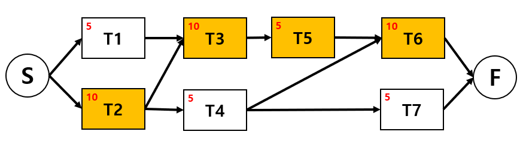

### activity network 그리기

### project를 가장 일찍 완료할 수 있는 날은?

* critical path 길이는 45이므로, **45일차**

### bar chart

### 각 activity별 늦게 시작할 수 있는 날짜

| 작업 | 소요기간 | 선행작업 | 일찍시작 | 늦게시작 |
| :--: | :------: | :------: | :------: | :------: |
|  T1  |    10    |          |    1     |    1     |
|  T2  |    10    |          |    1     |    1     |
|  T3  |    5     |    T1    |    11    |    11    |
|  T4  |    10    |    T3    |    16    |    21    |
|  T5  |    15    |    T3    |    16    |    16    |
|  T6  |    10    |  T2, T3  |    16    |    36    |
|  T7  |    15    |  T4, T5  |    31    |    31    |

### bar chart

* 왼쪽 그림은 특정한 제약조건이 없을 때 일반적인 barchart를 그린 그림
* 우측 그림은 문제의 조건을 적용했을 때 최단시간 프로젝트 작업 일정을 그린 그림
  * 조건1 : 2개의 작업까지만 동시 진행 가능
  * 조건2 : task는 분할할 수 없으며, 한 번 시작하면 중단 없이 완료할 때까지 진행

### activity network 그리기

### task의 duration, dependency 표 작성

| 작업 | 소요기간 | 선행작업 | 일찍시작 | 늦게시작 |
| :--: | :------: | :------: | :------: | :------: |
|  T1  |    5     |          |    1     |    6     |
|  T2  |    10    |          |    1     |    1     |
|  T3  |    10    |  T1, T2  |    11    |    11    |
|  T4  |    5     |    T2    |    11    |    21    |
|  T5  |    5     |    T3    |    21    |    21    |
|  T6  |    10    |  T4, T5  |    26    |    26    |
|  T7  |    5     |    T4    |    16    |    31    |