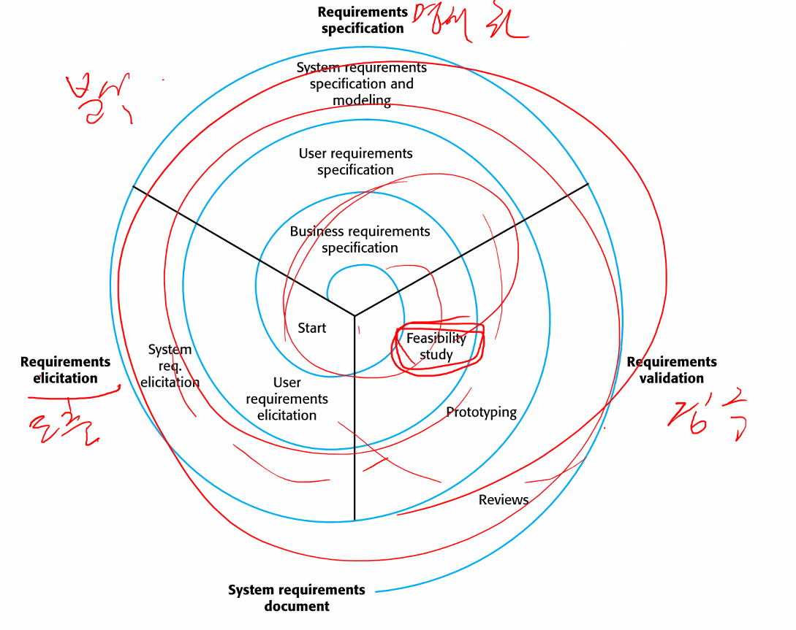
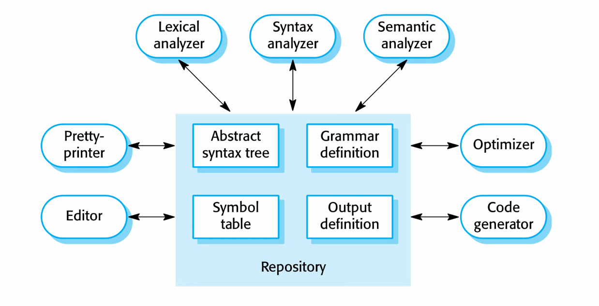
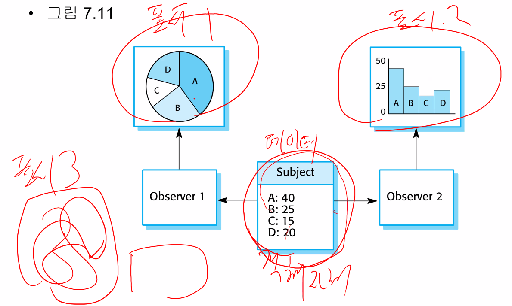

# 소프트웨어 공학

### 수업 목표

소프트웨어 개발 과정에서 일어나는 일들을 이해하고, 효율적인 소프트웨어 개발을 할 수 있는 능력을 배우는 것!

ex) 졸작 주제 - 상세 내용 - 구현 - 테스트
요구사항 - (설계 - 구현) - 시험
무엇을? 어떻게?


### 소프트웨어 개발 과정 ★

* **명세** (**specification**)
  * **요구사항 분석** (requirements) : 무엇을 만들까 하는 상세한 내용
* **개발** (**development**)
  * **설계**(design) + **구현**(implementation) : 어떻게 만들까? → 실제로 만들자
* **검증** (**validation**)
  * **테스트**(test) : 잘 되나~?
* **진화** (**evolution**)
  * 명세를 고치고, 개발 및 검증 과정을 반복하는 것

위와 같은 추상화 단계를 뭉뚱그려서 하기도 하고.. 여러 개발 방법들이 존재한다.


# 1장 서론 Introduction

### Software engineering

* 소프트웨어
  * 시설, 제품, 제조, 유통, 금융 등 모든 분야에 SW가 들어가 있다.
  * 점점 SW에 굉장히 많이 의존하게 된다.
  * HW는 만들면 바꿀 수 없지만, SW는 고치고 할 수 있으니 점점 시스템이 복잡해졌다.
* 다양한 종류의 소프트웨어 시스템
  * 다양한 소프트웨어 시스템이 존재하는데, 종류에 따라 다른 접근법 필요
  * 소프트웨어 공학에는 보편적 표기법이나 방법, 기법 등의 절차가 존재하지 않는다.


### Software project failures ★

* 소프트웨어 프로젝트 **실패** 요인 (완성은 하는데.. )
  * 시스템 복잡도 증가
    * 더 크고 복잡한 시스템을 구축하는 것이 가능하면서 **요구 사항이 변한다. ★** 만드는 중에도 변한다ㅋㅋ
    * 시스템을 더 신속하게 공급해야 하며 더 크고 **복잡한 시스템**이 필요하다.
    * 이전에 없던 새로운 기능을 가져야 한다.
  * 소프트웨어 공학 방법(프로세스, 절차) 사용의 실패
    * 소공 방법과 기술 사용 없이 누구나 프로그램을 작성할 수 있다. (쉽다)
    * 제품 서비스를 진화시키면서 동시에 소프트웨어를 개발한다.
    * 일상 업무에서 소프트웨어 공학 방법을 사용하지 않는다.
      * 일부만. SI에 개발할 때 문서도 내놔! 하니까 고객이 원하는 문서 만들려면 어느정도 따를 수밖에.
    * 결과적으로 일단 만들자! 하니까 SW는 비싸지고, 안정성, 신뢰성 부족하게 된다.
      * **복잡도(complexity)가 올라가면, 반드시 문제가 생긴다. ★** 성능, 안정성, 신뢰성... 버그 多
* 소프트웨어 공학의 역사
  * 1960년대 말부터, 소프트웨어가 복잡해지니 이런 위기(SW crisis)에 대해 말하기 시작했다.
  * 구조적 프로그래밍, 정보 은닉(information hiding or 캡슐화(encapsulation)), 객체지향 개발, 표준 표기법(UML)과 도구

StarUML


## 1.1 Professional software development

### Frequently asked questions about SE

* SW란?
  * 컴퓨터 프로그램과 관련 문서들
* 좋은 SW의 특성?
  * 요구되는 기능과 성능을 사용자에게 제공 (**요구사항은 계속 변한다. ★**)
  * 유지보수성 (maintainability) - 개발자
  * 확실성 (dependability), 사용성 (usability) - 사용자
* 소프트웨어 공학이란?
  * 초기 구상단계부터 운영, 유지보수를 포함해 소프트웨어 생산의 모든 공학 분야 (개발, 사용까지)
* **SW 공학 기본 활동? ★**
  * **명세(specification)**
  * **개발(development)**
  * **검증(validation)**
  * **진화(evolution)**
* 소프트웨어 공학과 과학의 차이??
* 소프트웨어 공학이 직면한 주요 도전 과제는?
  * **다양성**, 인도기간 단축 요구, 신뢰할 수 있는 소프트웨어 개발
* 소프트웨어 공학의 비용은?
  * 대략 60%가 개발(설계 구현)비용, 40%가 진화(테스팅) 비용
  * 맞춤 SW의 경우 종종 진화비용이 개발 비용을 넘어선다.
  * 유지보수 비용을 더 많이 쓴다는 것은, 많은 사람이 그 일을 하게 된다는 것...ㅠ


#### 소프트웨어 프로젝트를 망하게 하는 비법

* 커뮤니케이션 없이 각자 코딩에 전념할 수 있도록 노터지 하면 된다. ㅋㅋㅋ
* 서로 커뮤니케이션 하면서 의견을 조율하고 하는 것이 반드시 필요하다.


### Software products

* Software products
  * 일반 제품
    * **수평적**(horizontal) 제품 : 응용분야(domain)에 관계 없이 공통적으로 사용되는 서비스. DB 등 ★
    * **수직적**(vertical) 제품 : 특정 분야를 위한 서비스. ★


### Essential attributes of good software

* 수용성(acceptability)
  * 이해하기 쉽고
  * 사용하기 쉽고
  * 호환성이 있어야 한다.
* 확실성(dependability)과 보안성(security)
  * 신뢰성(reliability)
  * 보안성(security)
  * **안전성**(safety) : 사람, 환경 피해 x
* 효율성(efficiency)
* 유지보수성(maintainability)


* 소프트웨어 공학
  * 초기 명세 작성부터 유지보수까지, 모든 관점을 다루는 공학분야
* 소프트웨어 공학의 중요성
  * 점점 **소프트웨어 시스템에 더 많이 의존**한다. (확실성)
  * 소프트웨어 공학 방법 및 기법을 사용하는것이 결국 비용이 적게 든다.


### S/W 공학 프로세스에 있어서 활동 다시 정리! ★


* **명세(specification)**
* **개발(development)**
* **검증(vaildation)**
* **진화(evolution)**


# 2장 소프트웨어 프로세스

### 소프트웨어 프로세스 

* S/W system 개발 시 관련된 활동의 집합
* '보편적 S/W 공학 기법' 은 존재하지 않는다.
* 실제 **현장에선** : **소프트웨어 개발 방법론★**이라고 부른다.
  * 방법 : method ...
  * 방법론 : methology ...


### 기본적인 소프트웨어 공학 활동 ★

* 소프트웨어 **명세**(specification) : 요구사항 분석
* 소프트웨어 **개발**(development) : 설계, 구현
* 소프트웨어 **검증**(validation) : 테스팅 (시험)
* 소프트웨어 **진화**(evolution) : 유지 보수


### 프로세스 설명에 포함되어야 하는 것

* 제품(product)과 산출물(deliverable)
  * 무엇을(What) 
  * 프로세스 활동 결과물
  * 명세화, 설계, 구현, 테스팅
* 역할(role)
  * 누가(Who)
  * 참여자들의 책임
  * PM, 형상 관리자, 개발자
* 사전/사후조건(pre/post condition)
  * 언제(When) - 순서, 절차 등
  * 어떻게(How) - 노하우, 기법 등
  * 활동이 이루어지거나 제품 만들어지는 전후에 만족돼야 하는 조건
    * 뭐 문서작성 활동이 이루어지면 그 결과로 문서가 나와야 한다.. 하는거

```
ex) 시스템 분석가가 | 요구사항 문서 작성 → 고객, 아키텍트, 설계 → 요구사항 문서 검토 → ...
```

보통 현업에서는 **문서 ★**. 제품 산출물의 비중이 가장 크다.
실제 S/W 개발의 특성이, 계획한 대로 그대로 되는 경우는 없다...


* **계획주도(plan-driven) 프로세스** ★

  * 모든 프로세스 활동(activities)을 미리 계획하고 계획 대비 실적을 측정

  ```
  1단계 | 2단계 | 3단계 ... 등을 산출물 위주로 측정하겠다!
  ```

* **애자일(agile) 프로세스 **★

  * 계획은 점증적으로 세우고, 고객 요구를 반영해 프로세스를 간단히 변경

* 실제 process는 계획주도 / 애자일 접근법 둘 다 포함한다.


## 2.1 소프트웨어 프로세스 모델★

* **폭포수(waterfall) 모델**
  * **계획주도** 개발
  * 전체 시스템을 명세, 개발, 검증, 진화를 **개별적 프로세스 단계로 구분★**
  * 산출물 즉, **각 단계의 '문서'가 가장 중요하다.**
* **점증적(incremental) 개발**
  * 계획주도 or 애자일
  * **명세, 개발, 검증 활동이 중첩. 명확하게 단계를 구분하는 것이 아님!**
  * **시스템은 일련의 증가분(increment)으로 개발**됨, (**증분★**)증가분은 이전 버전과 비교하여 추가된 기능
* 통합 및 설정(integration and configuration)
  * 계획주도 or 애자일
  * **재사용** 기반의 다른 측면. 컴포넌트나 시스템 설정 후 통합
  * **실제 현장에서는 밑바닥부터 코딩은 거의 없다.**
* 실제 대부분의 대형 시스템 개발 process는 위 모든 모델 요소들을 포함한다.


### 폭포수 모델


* (명세) 요구사항 분석 및 정의
  * 시스템의 **서비스**(기능적 요구사항), **제약조건**(비기능적 요구사항) 및 목표 설정 → 시스템 명세서 작성 (문서)
* (개발) 시스템 및 소프트웨어 설계
  * 시스템 **아키텍처** 수립, 소프트웨어 구성요소 추상화와 이들간의 관계
* (개발) 구현 및 단위테스트
  * 설계를 프로그램으로 실체화. 실제로 코딩하는 것.
  * 단위 테스팅에서 각 단위가 명세에 맞는지 확인
* (검증) 통합 및 시스템 테스팅
  * 프로그램 단위를 통합해서 완전한 시스템으로 테스트하고 요구사항이 충족되었는지 확인
  * 하나씩 붙여가면서 테스트 해가는데, 통합해가며 각 단계별로 테스트 해가는건 통합 테스팅 다 붙여서 완성해놓고 테스팅하는 것은 시스템 테스팅이라고 구분하기도 한다만... 딱히 구분 안하기도 한다.
* (진화) 운영 및 유지보수
  * 시스템 설치, 사용
  * 오류 수정, 구현 개선, 새로운 요구사항 반영
  * 결함이 없는 시스템은 없다!!


#### **폭포수 모델 특징★**

* 각 단계의 결과로 산출물인 **문서★**가 있어야 함
* 원칙적으로 한 단계가 끝나야 다음 단계를 시작

#### **실제 S/W 개발은 각 단계가 중첩됨**

* 한 단계(구현, 설계)에서 다른 단계(설계, 요구사항)의 피드백이 일어남
* 이전 단계 문서를 수정하면 프로세스 지연이 일어남
* 추가 변경을 반영하지 않도록 명세서(sepcification)를 확정
* **단점, 변화하는 고객의 요구사항에 대응하기 어렵다...**

#### **폭포수 모델 적용 가능 분야**

* 요구사항 이해도가 높으며(즉, 많이 해봤으므로 변경이 적다) 설계 구현중 요구사항 변경이 제한된다.

#### **폭포수 모델 적합한 예**

* 임베디드 시스템
  * 하드웨어와 연동해야 하므로 구현시까지 의사결정을 미룰 수 없음
* 중대한 시스템
  * 명세와 설계에 대한 분석 및 검토가 필요
* 대규모 소프트웨어 시스템
  * 여러 회사, 장소에서 개발하므로 완성된 명세서가 필요

#### **폭포수 모델이 적합하지 않은 예**

* 자유로운 팀 커뮤니케이션
* 요구사항이 빠르게 변화 (이해도 ↓)
* 반복적(iterative)개발 (점증적) 과 애자일(agile)방법 (문서↓소통↑) 이 적합


### 점증적 개발


* 초기 구현 → 사용자 피드백 → 여러 버전을 거쳐 진화
  * **시스템의 증분(increment) ★**
* 명세, 개발, 검증이 명확히 구분되어 있지 않고 중첩되어 일어난다.
* 요구사항이 쉽게 변하는 시스템 개발에 적합 (이해도 ↓)
  * 대부분의 비즈니스 시스템이 이렇지... 요구사항은 항상 변하니까.
* 개발하며 발생하는 변경 사항에 대처하기 쉬움

#### **점증적 개발 장점★**

* **요구사항 변경을 구현하는 비용이 줄어듦**
* **개발된 내용에 대한 고객 피드백 받기 쉬움**
* **일부 유용한 기능만 포함한 S/W를 고객에게 전달해 사용하도록 할 수 있음**(증분)

#### **점증적 개발 문제점★**

* **프로세스가 가시적이지 않음 ★**
  * 관리자 진(척)도 측정을 위한 산출물(deliverable)이 필요
* 새로운 증분 추가에 따라 시스템 구조가 저하되는 경향이 있음
  * **구조 저하와 코드 복잡도를 줄이기 위해 정기적 리팩토링(refactoring)★이 필요**
* 대규모 시스템 개발에는 적합하지 않음


## 2.2 프로세스  활동

* 실제 S/W 프로세스는 명세(요구사항), 설계, 구현, 테스팅 등 활동이 중첩되어 있음
* 기본 프로세스 활동
  * 명세화, 개발, 검증, 진화
* 개발 프로세스마다 기본 활동이 다른 방식으로 구성됨
  * 폭포수 모델은 순차적 구성
  * 점증적 모델은 중첩되어 있음

**당연하지만 회사마다 다르다...**


### S/W 명세화★

#### **요구 공학(requirments engineering)**

* **요구사항 도출을 위한 프로세스★**
* 시스템이 제공할 서비스를 이해하고 정의하며, 시스템 운영과 개발에 대한 제약조건을 찾아내는 process
* 요구공학 이전에 **타당성 조사(feasibility study)★**나 마케팅 조사 등을 수행 가능
  * **타당성 조사 : 프로젝트가 이익이 되고 도움이 되는가? 가능성에 대해서. 기간에 대해서.**

#### **요구 공학 프로세스의 주요 활동**

(뒤에 4장에서 나올 이야기. 간단히 보고 넘어가자)

* 요구사항 도출과 분석(requirements elicitation and analysis) : 체계, 중요도, 시급성 등에 따라 **분류** 해야지
* 요구사항 명세화(requirements specification) : 산출물인 문서가 작성 되어야!
* 요구사항 검증(requirements validation) : 현실성, 일관성(모순, 충돌이 없느냐?), 완전성(빠진것은 없느냐?)을 '추구'


### S/W 설계 및 구현

**소프트웨어 설계**

* **시스템 명세**(구현)로부터 실행 가능한 시스템으로 변환하는 프로세스

  ... 그냥 넘어가셨네?ㅋㅋ

* 아키텍쳐(architecture) 설계
  * 시스템의 전체적 구조.
  * 주요 컴포넌트(서브시스템, 기능)와 이들(인터페이스)간의 관계 식별
* 데이터베이스 설계
  
  * 기존 DB 사용하는 경우 고려
* 인터페이스 설계
  * 컴포넌트(모듈) 간 인터페이스를 정의
  * 인터페이스 명세가 있으면 컴포넌트를 개별적으로 설계할 수 있음
* 컴포넌트 선택 및 설계
  * 재사용 가능 컴포넌트를 찾음
  * 새로운 컴포넌트를 설계

* 설계와 구현이 중첩되는 경우가 많다. ㅋㅋㅋ UML로 만들어 놓은대로 설계하는 경우는 '없다'ㅋㅋㅋ
* 플밍은 개별적 활동
* 테스팅, 디버깅.
  * 개발 코드는 반드시 테스팅이 필요하다. 단위 테스팅 (unit testing)
  * 테스팅으로 결함(defects) 존재를 확인
  * 모든 S/W는 결함이 있다!!


### S/W 검증 ★

#### **verification & validation**

* V & V ★ : v&v 가 나왔을 때는 번역 말고 영어 그대로 쓰자
  * **verification : 시스템이 명세대로 만들어졌나?★**
  * **validation : 시스템이 고객의 기대에 맞는가? 고객이 필요한 시스템인가?★**


#### **테스팅 단계**

* 컴포넌트 테스팅
  * 개별 컴포넌트(함수, 객체,... 이들의 그룹 등)를 테스트
* 시스템 테스팅 (통합 + 시스템)
  * 컴포넌트를 통합하여 시스템을 구성하고, 이를 테스트
  * 컴포넌트간 예기치 못한 상호작용, 인터페이스 문제 등을 찾는다.
  * 기능적 / 비기능적(성능, 신뢰도..) 요구사항 만족 여부, 창발적(emergent) 시스템 속성을 테스트
* 고객 테스팅
  * 고객의 실제 데이터를 이용하여 테스트


#### **V 모델**


* 폭포수 모델을 V자로 만들어서, 진행하는 방법. 각 단계에서 만들어진 문서들은 각 단계를 테스트 할 때 다시 사용한다 라는 개념!
* 각 단계에서 나온 산출물들이 테스트할 때 다시 사용된다!!


### S/W 진화

* 소프트웨어의 유연성(flexibility)
  * 크고 복잡한 시스템이 만들어짐
* 요구사항이 계속 변화하므로, S/W도 진화하고 변경되어야 한다.
* 개발과 유지보수(maintenance)의 구분이 줄어들고 있다.
  * 완전히 바닥부터 새로 만든 S/W 시스템은 거의 없다.
  * 요구사항 변화를 지속적으로 반영하며 S/W가 진화
* 그러면 구조가 엉망이 되니까 다시 리팩토링 refactoring < 재구조화 restructuring < 재공학 reengineering


## 2.3 변경처리

쭈욱 중요한 내용은 아니니 통과..

### 프로토타이핑

**요구사항 변경의 경우이므로 폭포수 X 점증적 O 애자일 O**

* **프로토타입(prototype)**
  * **특수한 목적 가진 S/W 시스템 초기버전. 시험용**
  * **아이디어 시연, 설계 옵션 시도, 문제점과 해결책 찾음**
* 프로토타입의 용도
  * 요구 공학 프로세스
    * 요구사항 도출과 검증에 도움을 줌
    * 프로토타입을 사용해보고 아이디어를 얻음
  * 설계 프로세스
    * 설계 문제에 대한 해결책 찾음, 설계 타당성을 확인하기 위한 실험
    * 주로 비기능적 요구사항 중점으로

### 점증적 인도★

*  **S/W 개발 마친 증분 일부를 고객에게 전달. 그리고 사용할 수 있도록 배포하는 것**
*  애자일 기법과 같은 점증적 개발 방법에서 사용하는 부분


## 2.4 프로세스 개선

여기도 그냥 읽어봐~ 자세히는 안하겠음

카네기 멜튼 대학에서 만들었다고 해서 CMMI.. SP..
얼마나 S/W 프로세스가 정립이 잘 되어있고, 수행이 잘 되고 있고, 측정이 잘 되는지.
소프트웨어를 평가하는 모델

**프로세스 성숙도 모델 수준**

* 초기, 관리, 정의, 정량적 관리, 최적화..


# 3장 애자일 소프트웨어 개발

* **신속한 S/W 개발과 인도(delivery)**★
  * 요즘 많은 비즈니스 시스템에서는 신속 개발과 인도가 중요!
  * 변화하는 비즈니스 환경에 따라 안정적 요구사항 얻기는 힘듦..
  * 시스템 경험 후 요구사항을 명확히 알게 되지만 요구사항은 계속 바뀜
* **계획 주도(plan driven) 프로세스는 신속한 S/W 개발에는 적합하지 않음**★
  * **안전성(safety)** 중심 시스템 같이, 완벽한 분석이 필요한 경우에는 적당함
    * 앞으로 개발자로 살면서 **안전성**에 대해서 관심을 가지자..!
* 애자일(agile) 기법의 등장
  * 익스트림 프로그래밍(Extrem Programming) **XP**
  * 스크럼(Scrum) 

**애자일 기법의 특징**

* 명세와 설계 및 구현이 중첩되므로, 설계 **문서를 최소화**
* 시스템을 연속적인 증분(increment)으로 구현하며 이해당사자(stakeholder)가 증분의 명세화와 평가에 참여
  * 이해당사자는.. 고객, 개발자, 돈 낼사람, 유지보수 등 관련있는 사람을 다 포함. But 주로는 '**최종 사용자**'가 중점!!
  * 보통 2~3주마다 새로운 **증분** 인도
  * 테스트 자동화 도구, 형상관리 도구, UI 생성 도구 등 여러 도구를 활용
  * (고객) 커뮤니테이션 활성화, 문서 최소화

**계획 주도 개발**

* 프로세스 단계별 해당하는 산출물을 생성하도록 각 단계를 나눔, 각 단계의 산출물이 다음 단계에서 사용됨

  ```
  요구사항 명세서가 나와야 → 설계 단계를 진행할 수 있는 것
  ```

* 활동별로 반복이 이루어짐.

**애자일 개발**
전체 과정을 반복하고, 점증적 인도!

* 설계와 구현을 프로세스 중심 활동으로 두고 요구사항, 테스팅 등을 설계와 구현에 포함시킴
* 요구사항과 설계를 따로 두지 않고 같이 발전시킴


## 3.1 애자일 기법

* Plan-driven(계획 주도 기법)은 요구사항, 설계 등 문서화에 중점
  * 대규모, 오래 지속되는 S/W 시스템 개발에 적합
  * 중소 및 비즈니스 시스템 개발에는 오버헤드가 크다
  * 요구사항 바뀌면 명세, 설계, 프로그램 다 변경해야 한다
* 1990년대 말, 애자일 기법의 등장!
  * 개발팀이 설계와 문서 작업보다 소프트웨어 자체에 더 집중하게 한다.
  * 요구사항 자주 변경되는 (이해도↓) 앱 개발할 때 적합
  * 반복적 개발
  * 고객이 작동하는 S/W를 점증적으로 개발해서 인도!

**애자일 선언**


왼쪽 그룹의 내용이 오른쪽보다도 중요하다!

**애자일 기법의 원칙**

| 원칙                 | 설명                                                         |
| -------------------- | ------------------------------------------------------------ |
| 고객 참여            | 고객이 개발 프로세스 전체에 밀접하게 관여한다. 고객의 역할은<br />요구사항을 제공하고 우선순위를 정하고 시스템의 반벅을 평가하는 역할 |
| 변화 수용            |                                                              |
| 점증적 인도          |                                                              |
| 단순성 유지          |                                                              |
| 프로세스가 아닌 사람 |                                                              |

* 소프트웨어 회사가 중소규모 제품을 개발
* 고객이 개발 프로세스에 참여할 수 있어야
* 조직 내에서 이루어지는 맞춤형 개발
* 같은 장소에 있는 팀으로 구성
  * 실무에서는 무엇보다도 신속한, 밀접한 **★의사소통이 무엇보다 중요★**하다.


## 3.2 애자일 '개발'기법

### Extreme programming (XP)

* 극단적으로 **반복적인★** 접근법 (iterative)
* 하루에 여러 개의 버전, 2주마다 증분을 인도 (increment)
* 요구사항을 간단하게 사용자 스토리(user story)라는 시나리오로 표현 / 사용자 스토리는 과업(task)으로 나누어 구현
* 프로그래머는 짝으로 개발, 코드 작성 전 테스트를 먼저 작성 → 테스트 주도 개발 (**T**est **D**riven **D**evelopment)
* 새로운 코드를 시스템에 통합하려면 **모든★** 테스트를 통과해야 한다. (**새 테스트를 추가할 때 기존 테스트까지 다**)
* 시스템을 자주 배포


### XP 원칙


### XP와 애자일★

1. 점증적 개발은 빈번하고 작은 릴리즈 통해 지원된다.
2. 고객 참여는 고객이 개발팀에 지속적으로 관여하여 개발에 참여하고, 요구사항 뿐 아니라 테스트도 같이 해야 한다.
3. '프로세스'가 아닌 사람은 짝 프로그래밍, 공동 소유권, 초과근무를 지양하는..
4. 변화 수용은...
5. '단순성 유지'...

**기억할 것은, xp가 애자일의 이런 특성들을 가지고 있다 하는 것.**    xp 특성 애자일 특성
**리팩토링★(refactoring)은...** 
**단순한 설계★**는 오늘만 살자! 현재 요구사항만 만족시키는 설계


* 대부분 XP의 실무 적용이 어렵다!
  * 실무 원칙 골라서 사용
  * Scrum과 같은 **관리** 중심 기법과 함께 사용
* **주요 실무 원칙**   (**그나마 실무에 적용 가능한것들**)
  * **테스트 우선 개발 (주도 개발은 TDD)**
  * **리팩토링 (refactoring, 애자일이 아니어도 활용 가능)**
  * **점증적 개발 (incremental development)**
  * **사용자 스토리 (시나리오, 태스크)**
  * 짝 프로그래밍...


* XP의 요구사항 관리
  * 요구사항 변경을 지원하기 위해 별도의 요구공학 활동을 두지 않는다.
  * 시스템 사용자가 경험할 수 있는 일종의 사용 시나리오인 사용자 스토리를 만들어 관리
  * 고객은 개발팀과 스토리 카드를 작성, 스토리 카드를 과업(task)으로 나누어 개발
* 사용자 스토리의 장단점
  * 요구사항 문서나 유스케이스(use-case)보다 쉽게 이해 가능
  * 요구사항 완전성 문제
    * 스토리들이 시스템의 중요한 요구사항 전체를 포함하였는가
    * 개별 스토리에서 누락된 내용은 없는가


### 리팩토링 (Refactoring) ★

소프트웨어의 구조와 코드의 가독성을 개선하는 작업을 말하며, 클래스의 계층 구조를 변경하거나 코드의 중복을 줄이는 것, 변수나 메소드의 이름을 적절히 변경하는 것 등의 예시가 모두 리팩토링 활동에 해당된다.

XP나 애자일 기법 등 점증적 개발 방법에서 리팩토링을 진행하는 것이 중요하다고 알려져 있는데, 사실 어떤 경우에도 코드의 변경은 반드시 일어나므로, 소프트웨어 개발에 있어서 리팩토링은 매우 중요하다고 볼 수 있다!!

* 전통적인 소프트웨어 공학
  * 변경을 고려한 설계를 하라
* XP
  * 변경이 없을 수도 있고, 변경 요청은 수시로 이루어지니 그건 시간 낭비다!
  * 변경은 필연적 발생 + 점증적 개발 → S/W 구조 망가짐
  * 지속적 리팩토링으로 소프트웨어 구조와 가독성을 개선 → 구조적 악화 막기, 변경 처리 쉽게 하기
* 리팩토링의 예시는 많다!
  * 중복코드 제거, 클래스 계층 구조 변경...
  * 속성, 메소드 이름 적절히 변경...


### 테스트 우선 개발

* XP의 테스트
  * 명세 없이 테스팅하는 문제
  * 테스팅 자동화하고, 변경 후 **모든 테스트**를 통과해야 진행
* XP 테스팅 특징
  * 테스트 우선 개발  |  테스트 → 코딩 → 테스팅
  * 시나리오 이용, 점증적 테스트 개발
  * 테스트 개발과 검증에 사용자 참여
  * 테스트 자동화 프레임워크 사용
  * 스토리 카드 → (과업)태스크(개발) → 태스크 별 테스트 작성
  * 고객은 다음 릴리스에서 개발할 인수 테스트의 책임도 있다


### 테스트 주도 개발 ★

Test-Driven Development

* **테스트 주도 개발 (TDD)★**
  * **코드 작성 전 테스트를 먼저 작성**
    * spec에 의해 테스트 → 블랙박스 테스팅 / 내부 구조를 알고 테스트 하는 것은 화이트박스 테스팅
* **테스트 주도 개발 특징**★
  * **테스트를 작성하려면 기능과 인터페이스에 대해 알아야 하므로 요구사항을 명확히 할 수 있음**
  * 테스트 지연 문제 방지
  * **자동화된 테스팅 프레임워크 사용 필수 (JUnit 등)**
    * 테스트 쉽게 작성
    * 테스팅 자동 실행 가능
    * 테스팅 결과 명세에 맞는지 확인 가능
  * ... + 테스트를 예전에 통과했던 것 까지도 전부 다 돌려봐야...!! (회귀 테스팅)


### 테스트 자동화

* ...는 TDD에 필수적
* 테스팅 컴포넌트
  * 독립실행 가능!
  * 테스트 입력과 결과 확인 가능
  * JUnit 등 자동화 프레임워크 이용
* 테스트 커버리지(coverage)★
  * 완전성 판단 X
  * 예를 들어, 구조적 화이트박스 테스팅에서... 전체 라인 수 중에 절반만 실행이 된다면 50%만 커버될 수 있다...?
  * **절대로 완벽한 테스트는 없다**는 것을 말하고자..ㅋ 고쳤으면 반드시 테스트 해라.


### 짝 프로그래밍

* 짝 프로그래밍 : 짝을 지어 코드를 같이 개발(짝이 바뀔 수 있음)
* 장점
  * 공동 소유권과 책임을 지원
  * 다른 사람이 코드를 보기에, 비공식적 리뷰 프로세스가 진행됨 (코드 인스펙션 inspection)
    * 테스팅이 동적인거라면, 인스펙션은 정적인 것. 사람이 직접 코드 리뷰하는 것들...
  * 리팩토링을 장려하고 지지
* 실무 적용
  * 경험 多 개발자 + 경험 少 개발자
  * 학생의 경우.. 


## 3.3 애자일 프로젝트 관리

* 계획주도 접근법
  * 폭포수 모델 (plan driven)
  * 무엇이, 언제 인도, 누가 산출물(**문서**) 만들 것인지 계획을 가지고 있음. What, When, Who, How
  * 관리가 쉬움
* 애자일 기법


### 스크럼 (Scrum )

* 스크럼은 애자일 프로젝트를 조직화하고 가시성을 제공하기 위한 프레임 워크
  * 반복적 개발 관리에 중점!!
  * 특정 애자일 실무원칙을 요구하지 않음
* 용어 ★
  * 스크럼 마스터 : 프로젝트 관리자
  * **제품 백로그(backlog)** : **할일. To do list!!**
  * **스크럼** : 개발 팀 **회의**
  * **스프린트 (sprint)** : **반복!!**


* **'관리 방법' 자체도 스크럼이라고 하고, 회의를 스크럼이라고 하기도 한다.**


#### 스크럼 스프린트 사이클

* 2~4주 범위의 권장 (고정)길이
  * 완성 못한 작업을 처리하기 위해 기간을 늘리지 않음
  * 마치지 못한 작업은 **제품 백로그(전체 할 일)**로 돌러놓음
* 제품 백로그 항목들의 우선순위를 매겨 **해당 스프린트**에 작업할 **스프린트 백로그**를 선정
* 매일 스크럼을 진행 (팀 규모가 작아야 가능..)
* 스크럼 보드 두어 정보 공유
  * 스프린트 백로그, 진행상황, 완료된 작업 등 표시
  * 누구든지 변경 가능


# 4장 요구공학

* 요구사항 (requirements)
  * 시스템이 제공하는 서비스(services)와 서비스에 대한 제약조건(constraints)
    * **기능적** 요구사항 : 서비스
    * **비기능적** 요구사항: 특성, 제약조건
* 요구공학 (requirements engineering)
  * 요구사항을 찾고(도출), 분석하고, 문서화하고, 점검하는 프로세스
  * 요구사항은 반드시 '변한다'
* 사용자 요구사항(user requirements)
  * 고수준의 추상적 요구사항.. **사용자**가 보고 잘 이해하도록
  * 말로쓰고, 다이어그램 활용해서 시각적으로 잘 이해 되도록
* 시스템 요구사항(system requirements)
  * 시스템이 제공해야 할 내용을 상세하게 기술.
  * 설계 / 구현 관련된 내용을 **개발자**가 보기 위해 문서로 작성
* 시스템 이해 당사자(system stakeholders)
  * 시스템(개발, 운영 등 모든 과정)의 영향을 받는 사람
  * User, System Manager, System Owner, 외부 이해 당사자 등
  * ex) Mentcare 시스템의 이해 당사자
    * 환자, 의사, 간호사, IT 관리자... 에붸붸

**기능 / 비기능으로 나눌 수도 있고 (내용에 대한 측면)  |  사용자 / 시스템으로 나눌 수도 있다 (대상)**


#### **타당성 조사(Feasibility study)**★

* **이 프로젝트가 도움이 되느냐? 에 대한 판단**
* 요구공학 프로세스 초기의 짧은 기간동안 진행
* **목적**
  * **시스템이 조직 전체 목표에 기여하나?**
  * **기한 내에 주어진 예산으로 현재의 기술을 이용해 구현 가능한가?**


## 4.1 기능적 / 비기능적 요구사항 ★

* 기능적 요구사항
  * **시스템이 제공하는 서비스**(기능), 시스템이 특정 입력/상황에 어떻게 반응/행동하는지
  * 무엇을 해야 함 / 무엇을 하지 말아야 함
* 비기능적 요구사항
  * 시스템이 제공하는 서비스 또는 기능**에 대한 제약조건**(constraints), 개발 프로세스나 표준에 대한 제약조건
  * DB는 뭘 써야한다, 웹서버는 뭘써야한다 등
  * 개별 특징이나 서비스보다는 시스템 전체에 적용되는 경우가 많음 (창발성 emergent property)
* 도메인 요구사항
  * 응용 도메인에서 주어진 새로운 요구사항 또는 기존 요구사항에 대한 제약조건
  * !!@@!@!@ 넘어갔어


### 기능적 요구사항★

* **시스템이 제공하는 서비스(services)나 기능(functionality)을 기술**
* **시스템이 무엇을 해야 하는지 / 하지 말아야 하는지를 나타냄**
* 기능적 사용자 요구사항
  * 시스템이 뭘 해야하는지 고수준으로 기술
* 기능적 시스템 요구사항
  * !@!@@!@ 넘어갔어
  * 
* 요구사항 명세의 부정확성
  * 모호한 요구사항은 사용자와 개발자가 서로 다르게 해석할 수 있어 분쟁을 일으킬 수 있음
  * 예 : 예약 리스트 검색?
* 요구사항의 **완전성(completeness)**
  * **모든 서비스와 정보가 정의되어야 함**
* 요구사항의 **일관성(consistency)**
  * **충돌하거나 모순되는 요구사항이 없음**
* **요구사항은 이상적으로 완전하고 일관적이어야 하다.**
  * **현실적으로 불가능**. (실수, 누락, 이해 당사자간 충돌)


### 비기능적 요구사항 ★


* 시스템이 제공하는 서비스가 아닌 요구사항... 아무튼, **특성과 제약조건이면 전부 비기능적 요구사항이다**.
  * 전체 시스템에 대한 명세나 제약조건
  * 신뢰성, 응답시간, 메모리 사용량 등 **창발적(emergent) 시스템 속성과 관련된 제약**
  * I/O 장치 성능, 다른 시스템과 인터페이스에 사용되는 데이터 표현 등 시스템 구현과 관련된 제약
* 비기능적 요구사항이 만족되지 않는 것이 기능적 요구사항 경우보다 심각할 수 있음
  * **보안성(security)**, **안전성(safety)**, **신뢰성(...?relability)**.. 등 **기능이 아니면 다 비기능적 요구사항**
* 비기능적 요구사항은 특정 컴포넌트보다 시스템 전체 아키텍처에 영향을 받는다.


**외울필요는 없고, 왜 이게 이 분류인지 이해할 필요가 있다.** 비기능적 요구사항을 찾아내기를 할 때 보면서 하면 도움이 됨

* **제품** 요구사항 (product requirements) - 제품 자체가 가지고 있는, 가져야할 제약 조건.
  * 사용성
  * 효율성
    * 성능
    * 공간
  * 확실성(신뢰성, 가용성...)
  * 보안
* **조직** 요구사항 (organisational requirements) - 개발하거나 운영하는 조직
  * 환경 - 특정 DBMS, 미들웨어, OS를 써야 한다던가
  * 운영
  * 개발 - 개발 프로세스를 따라야 한다던가
* **외부** 요구사항(external requirements) - 법률이나, 윤리, 사회 규제 등
  * 규제
  * 윤리
  * 법률


p.104

* 비기능적 요구사항 문제는, 이해 당사자들이 일반적인 목표(goal)로 요구사항을 제시한다.
  * 사용하기 편함, 고장시 시스템 회복 능력, 사용자 입력에 대한 빠른 반응 등
* 목표
  * 사용자의 일반적 의도
  * 개발자에게 사용자의 의도를 전달하는데 도움이 됨
* 확인 가능한 비기능적 요구사항
  * 객관적으로 테스트 할 수 있는 ....... 으으 오늘 왤케 하기 싫지


## 4.2 요구공학 프로세스

* 활동
  * 도출(elicitation)
  * 분석(analysis)
  * 명세(specification)
  * 검증(validation)
* 실무에서는 모든 활동들이 중첩, 반복되어 진행된다.



한번에 끝나는게 아니라 뱅글뱅글 돌면서.. 반복되면서 된다~~


## 4.3 요구사항 도출


**그렇다면 실제로 도출을 어떻게 할 것이냐?** 요구사항을 도출할 때 사용하는...

#### 관점(viewpoints)★

* 공통점을 가진 이해당사자 그룹으로부터 요구사항을 수집하고 구성하는 방식
* 요구사항 분석을 위해 이해 당사자(stakeholder) 정보를 조직화
  * 이해당사자 그룹이 하나의 관점을 가졌다고 간주하고 해당 그룹이 가진 관점으로부터 요구사항을 수집
* 도메인 요구사항이나 타 시스템 관련 제약조건을 나타내는 관점을 포함시킬 수 있음
* 상이한 이해당사자들은 요구사항의 중요도와 우선순위를 다르게 생각


#### 요구사항 도출 기법

* 제안된 시스템에 대한 정보를 찾는 방법
  * 다양한 이해당사자, 기존 시스템에 대한 지식, 문서
* 요구사항 도출을 위한 주요 기법
  * 인터뷰
  * 관찰 또는 문화기술적 연구 - 도메인 일하는 방법 / 절차를 관찰...
* 인터뷰 유형
  * 미리 질문 목록이 있는 폐쇄적 인터뷰
  * 개방적 인터뷰
* 인터뷰의 문제점
  * 도메인 전문 용어는 비전문가가 이해하기 어려움
  * 전문가는 어떤 도메인 지식은 언급하지 않음

조직간의 미묘한 권력관계 등으로 인해 인터뷰는 요구사항 제약의 도출에는 효과적인 방법은 아니다...


* 문화 기술적 연구
  * 운영 프로세스를 이해하고 관찰하는 기법
* 문화기술적 연구가 효과적인 경우
  * 실제 일하는 방식으로 얻을 수 있는 요구사항
* 문화기술적 연구는 프로토타입 개발과 결합될 수 있음
  * (뭐 문화 기술적 연구 뿐 아니라 인터뷰나 다른 것도 마찬가지. 결합되면 요구사항 도출하는데 도움이 되겠지)
  * prototype(원형) : UI, 내부 기능 등...
* 혁신과 문화기술적 연구
  * Nokia는 문화기술적 연구를 통해 새 제품의 요구사항 도출 (망함)
  * Apple은 기존 사용법을 무시


**요구사항 도출 관점을 고려하면서**

* 인터뷰
* 문화기술적 연구
* 시나리오


### 스토리와 시나리오

* 스토리와 시나리오
  * 특정 작업을 위해 어떻게 시스템을 사용하는지 기술
  * 무얼 하는지, 사용하는 정보는 뭔지, 어떤 시스템을 이용하는지...
* 시나리오
  * 사용자 상호작용이 이루어지는 일정 구간에 대한 사례를 구조적으로 설명
  * ATM 출금할 때의 사례를 예를 들어서!
* 시나리오의 구성
  * 시나리오 시작될 때 시스템과 사용자가 기대하는 것에 대한 설명
  * 정상적인 사건 흐름에 대한 설명
    * ex) 출금 - 거래 계속 - 카드 - 금액 - 비밀번호 - 현금 - 문닫 - 안녕히
  * 비정상적인 경우와 대처 방안에 대한 설명
    * ex) 잔액 부족, 사용자가 취소 등...
  * 동시에 진행할 수 있는 다른 활동에 대한 정보
  * 시나리오가 끝날 때 시스템 상태에 대한 설명


## 4.4 요구사항 명세

* 이상적으로 **요구사항은** **시스템 설계와 구현에 대한 사항을 다루지 않아야 함**, 시스템의 외부 행동(기능적)과 운영상의 제약조건(비기능적)을 기술해야 하고

* **하지만 현실적으로 요구사항에서 설계 정보를 완전히 제외하는 것은 불가능**

  * 초기 아키텍처 설계가 요구사항을 구성하는데 도움이 된다.
  * 대부분 시스템은 기존 시스템과 상호작용이 필요
  * 비기능적 요구사항을 만족시키기 위해 특정 아키텍처를 사용해야 하는 경우

* 자연어 명세 작성 지침

  * 표준 형식을 만들어 사용
  * 필수적인 사항과 바람직한 사항을 구분하기 위해 일관성 있는 표현을 사용
  * 중요 부분의 글자를 강조
  * 요구사항의 독자가 기술 용어(약어)등을 다 알고있다고 생각하지 말 것
  * 가능하다면 사용자 요구사항에 대한 이유를 기록하여 변경 시 활용
    * 왜 포함되었는지
    * 누가 제안했는지 (요구사항 출처)

* 구조적 명세

  * 표준 서식을 만들어 사용하는 예시. / 회사에선 주로 엑셀을 만들어서 많이 사용한다고 한다. 암튼 가서 회사별로
  * 각 항목을 만들어놓으면...

  

  * 항목들이 명확하지 않고 헷갈릴 수 있으니 추가로 조건을 달아준다.

  


### 유스케이스 ★

* 유스케이스 모델링을 요구사항 도출 기법으로 사용해서, 도출된 결과를 유스케이스 모델로 다시 기술할 수 있다.
  * 비기능적 요구사항은 다룰 수 없다! **기능적 요구사항 집중된 부분**
* 구성요소
  * **유스케이스(use case) : 시스템이 수행하는 기능 ★**
    * 어느 정도를 기능으로 분류 할 것이냐는 모델링 하는 사람 마음.
    * 주로 **사용자의 목적 달성하는 정도를 기준으로 기능을 분류한다.**
    * 기능의 단위를 사용자 설명서 항목 정도로 생각하면 될 듯 하다.
  * **액터(actor)** : **시스템과 직접 상호작용 하는 모든 것**. **역할,** **사용자** ★
    * **시스템과 직접 상호작용 이라 한다면, 사람일 수도 있고, 기계일 수도 있고, 다른 시스템일 수도 있고**.
      * 무전할 때 사람도 Actor고, 무전기는 Actor 가 될 수 있다.
      * ATM을 예를 들면 사용하는 고객이 Actor이고, 은행 서버도 Actor이다.
    * 시스템 운영 시 사용
  * **유스케이스와 액터간의 관계 : 연관(association)** 
    * **사용자와 기능 사이에는 연관이 있어야 한다**


* 액터들을 찾아보았다.
* 그리고 액터들이 무슨 기능들을 사용 하는지.
* **그리고 유스케이스 안에는, 시나리오가 들어있다.**


## 4.5 요구사항 검증

들어가기 전에.. **V&V 나왔을 때는 verification & validation 그대로 사용하자 했었다! ★**
**spec에 맞는 SW를 개발했느냐에 대한 V**  &  **고객이 원하는 것인지, 실제로 필요한 것인지에 대한 V**
그 외에 책의 나머지 부분에서는 validation은 검증이라고 번역하고 있다.

* 요구사항 **검증**
  * 고객이 원하는 시스템을 제대로 정의하고 있는지 점검
  * 요구사항 문제를 수정하는 비용은 설계나 구현 오류를 수정하는 경우에 비해 매우 크다.
    * 목적지를 잘못잡으면, 돈이 많이 든다...
* 요구사항 검증 기법
  * 요구사항 검토(review)
  * **프로토타이핑(prototyping) - 실행 가능? UI를 통해서 기능검증 / 또는 껍데기 없이 어느정도 성능검증도 가능하다**
  * 테스트케이스 생성

요구사항 → 만족? 테스트 데이터. 입력은 뭐고 결과 값은 뭐가 나와야 하냐?
명세 - 개발 - 검증 - 진화


### 요구사항 검증 수행★

* **유효성(validaity)**
  * **사용자의 실제 요구를 반영하는지** 점검
* **일관성(consistency)** - **을 추구하는 것..**★
  * **요구사항ㅣ 서로 충돌하지 않고 모순이 없는지** 점검
    * 다양한 **이해 당사자들간 의견 충돌**이 있을 수 있다.
* **완전성(completeness)** - **을 추구하는 것..**★
  * 사용자가 **의도한 모든 기능과 제약조건이 포함되었는지** 점검
* **현실성(realism)**
  * 기존 지식과 기술을 사용하여 주어진 **예산, 자원으로 구현이 가능한지** 점검
  * **타당성 조사(feasibility study ) : 프로젝트가 이익이 되고 도움이 되는가? 가능성에 대해서. 기간에 대해서**★
* **검증가능성(verifiability)**
  * 시스템이 각 요구사항을 만족시키는지 보여주는 **테스트를 작성할 수 있는지** 점검
  * 현실적으로 만들 수 있는것인지 정도만 보아도.. 왜냐면 요구사항은 계속 변하니까..


## 4.6 요구사항 변경★

* 요구사항이 변하는 주요 원인
  * 시스템의 비즈니스와 기술적 환경은 계속 변화함
  * 개발 비용을 지불하는 사람이 시스템의 사용자가 아님
  * 대규모 시스템은 서로 다른 요구사항과 우선순위를 가진 다양한 (이해 당사자) 집단이 관여
* 공식적인 요구사항 관리 프로세스가 필요
  * 요구사항 변경으로 인한 영향을 평가
  * 개별 요구사항을 추적하고 연관된 요구사항들 간 관계를 관리
  * 애자일 프로세스에서는 개발 과정에서 변경되는 요구사항을 처리하므로 공식적인 변경 프로세스가 없음
* **추적성, 추척가능성 (Traceability)★** 을 유지할 필요가 있다.. 용어!
  * 요구사항 출처(source), 요구사항간 관계, 요구사항과 시스템 설계 간의 관계를 추적할 수 있어야 함
  * 변경의 이유와 출처를 관리
  * 제안된 변경이 시스템의 어떤 부분에 영향을 주는지 분석


# 5. 시스템 모델링

* 시스템 모델링(System modeling)
  * 시스템의 추상 모델을 개발하는 프로세스이며, **각 모델은 시스템의 서로 다른 뷰(view)나 관점(perspective)을 나타냄**
    * 유스케이스 모델은 사용 관점에서의 View!
    * DB 모델은 뭐... 관점에서의 View
  * 보통 UML 다이어그램 표기법 이용
* 모델의 용도 !!! 아이디어 스케치!!, 연습장 메모 라는 개념을 가지면 될 것 같다. ★
  * 요구공학 프로세스 : 상세 요구사항을 이끌어 내기 위해(도출) ... 시나리오, 유스케이스 모델링
  * 설계 프로세스 : 시스템을 설명하기 위해... 클래스 다이어그램... 유스케이스...
  * 구현 후 : 시스템 구조와 동작을 문서화 하기 위해...
* 시스템 모델은 시스템의 완전한 표현이 아니라는 것을 이해하는 것은 중요하다.
  * 이해하기 쉽도록 자세한 부분은 모델에서 의도적으로 **제외**하고, 보여주고싶은 것만 표현한다!!
  * 모델은 시스템의 다른 표현이 아닌, 시스템의 추상화(abstraction)임


**시스템 관점** system perspectives

* 외부(external)관점

  * 시스템의 컨텍스트나 환경을 모델링
  * 컨텍스트 모델링...??

  

* 상호작용(interaction) 관점

  * 시스템과 그 환경 사이의 상호작용 또는 시스템 컴포넌트 간의 상호작용을 모델링
  * **동적**
    * **시나리오, 시스템과 액터 사이의 상호작용**
    * **클래스 객체들 간 상호작용. 메시지**


  

* 구조(structural)관점

  * **정적**
    * **시스템의 구성이나 시스템에 의해 처리되는 데이터의 구조를 모델링.**


  

* 동작(behavioral)관점

  * 시스템의 동적인 행동과 시스템이 이벤트에 어떻게 반응하는지 모델링


**Use of graphical models**

* 시스템에 대해 토론하고 아이디어를 도출하는 용도
  * 모델은 불완전할 수 있으며 표기법을 약식으로 사용 가능
  * 주로 애자일 기법에서 사용하는 방법
* 기존 시스템을 문서화하는 용도
  * 모델이 완전할 필요는 없으나 모델이 정확해야 함
* 시스템 구현을 생성하는 모델기반의 프로세스의 입력
  * 소스코드를 생성하는데 사용되므로 모델이 완전하고 정확해야 함 (특수 응용분야에서만 사용한대)


**UML diagram types**

* 이런식으로 생겨먹은 것이 **클래스 다이어그램**이다!


* 이런식으로 생겨먹은 것이 **액티비티 다이어그램**이다!
  * 순서도라고 생각하면 된다.
  * 이건 **'행동'**에 대한 것. 문을 열다 / 문을 닫는다 / 문을 잠근다.


* **유스케이스 다이어그램**. 아까 해봤던거.


* **시퀀스 다이어그램**에서 시스템 컴포넌트 간의 상호작용


* **시나리오**를 **시퀀스 다이어그램**으로 나타낼 수 있다.


* **상태 다이어그램**은 액티비티 다이어그램과 비슷해보이는데, 이건 '상태'에 대한거다.
  * 문이 열려있는 상태 / 문이 닫혀있는 상태 / 문이 열려있는데 잠겨있는 상태 / 문이 닫혀있는데 잠겨있는 상태


이제 다시 이걸 봐봅시다.


모델, 특정 관점에서만 보는 것!!

## 5.1 컨텍스트 모델

* 컨텍스트 모델
  * 시스템의 운영 환경을 기술
  * 시스템의 경계와 시스템과 연동되는 외부 시스템을 보여줌
  * **시스템 자체에 연동 되는 외부 시스템**
* 비즈니스 프로세스 모델
  * 전반적인 **업무의 흐름**을 보여줌
  * 컨텍스트 모델과 함께 사용될 수 있음
  * UML 액티비티 다이어그램으로 표현
  * **순서도로 보여주면 좋을 듯**

어떤 시스템이든지 간에, 업무의 흐름 (수강신청이다 하면, 학적은 재학상태여야 하고, 과목은 강좌 개설이 되야)


* 중심 주변에 다른 시스템들이 있어요~ 하는 것


* 액티비티 다이어그램 표기법


* [ 대괄호 ] 안에는 조건이 들어간다.


## 5.2 상호작용 모델

* **상호작용 모델의 용도**
  * **사용자(Actor)와 시스템 간 상호작용 모델**은 **사용자 요구사항(시나리오)**을 확인하는데 도움
  * 시스템 간 상호작용 모델은 시스템 간 커뮤니케이션 문제 발생 가능성을 해결
  * 컴포넌트 간 상호작용 모델은 시스템의 구조가 성능과 확실성을 제공할 수 있는지 이해하는데 도움


* 상호작용 모델 종류
  * **유스케이스 다이어그램 : 시스템과 사용자 / 다른 시스템 간 상호작용**
    * 정적. 무슨 기능이 있는지, 그걸 사용하는게 누구냐? 까지만 정적으로 보여주는 것.
    * 그래서 유스케이스를 상호작용 보여주는 거라고 보기에는 조..금 무리가 있을수도.
  * **시퀀스 다이어그램 : 시스템과 사용자, 다른 시스템간, 시스템 컴포넌트 간 상호작용 다 보여줄 수 있다**
    * 동적. **실제 사용되는 실제 시나리오**를 보여줄 수 있는 것


### 유스케이스 다이어그램★

* **유스케이스(use case)★**
  * 시스템이 제공하는 기능
  * 공통적인 사용자 **목표**와 관련된 시나리오의 집합.
    * ATM에서 비밀번호 입력같은건 사실 사용자의 '목적'에는 부합하지 않다고 생각하게 된다.
* **액터(actor)★**
  * 시스템과 **직접** 상호작용 하는 모든 것
  * 시스템이 사용되고 운영될 때, 직접 사용되는 모든 것을 말한다.


멘트케어 유스케이스 모델 예시


* 화살표에 큰 의미를 두지 말자~


### 시퀀스 다이어그램★

* **사용자와 시스템 간 상호작용을 나타내는 시퀀스 다이어그램**
  * **시나리오를 표현하는데 사용한다. ★**
* 예시


* alt : alternative
* 위에건 UML 표기법 정확하게 그린건 아니다. 대충 그린 것.
* 점선은 보통 반환을 나타낸다.


* 이것도 하나의 예시. 내용은 필요 없고 형식만 보자.


* opt : if
* alt : if / else
* 객체 옆구리에 화살표는 생성메시지입니다~


* 시퀀스 다이어그램 표기법


* 객체 생명선은 네모 아래로 쭈욱 내려오는 것...


## 5.3 구조 모델★

* **구조 모델은 시스템을 구성하는 컴포넌트들과 그들 간의 관계를 보여준다.**
  * 시스템의 **설계 구조**를 보여주는 **정적 모델**
    * **정적 모델이 주축이 된다.**
  * 시스템이 실행될 때의 구성을 보여주는 동적 모델
* **클래스 다이어그램**
  * 소프트웨어 시스템을 구성하는... 이게 대표주자이다.

* 클래스(class)
  * 한 가지 종류의 시스템 개체를 일반적으로 정의
  * 같은 **속성\_attribute**(데이터필드, 멤버 변수), **오퍼레이션\_operation**(메소드, 멤버 함수), 관계, 의미를 가지는 객체 집합에 대한 설명


* **연관(association)**
  * **클래스 객체 간의 관계**를 연관이라고 한다.
  * 연결(link)은 연관의 인스턴스. 무슨 말이냐?
    * 아래와 같이 클래스와 클래스가 있다면, 나중에 객체가 만들어질거란 의미.
    * 그래서 **클래스의 인스턴스는 객체, 클래스 사이 연관의 인스턴스는 연결**


* 연관의 속성
  * 이름, 다중성(multiplicity), 끝점 이름(end name), 도달성(navigability)


* 다중성 이야기.
  * .. 은 범위를 나타낸다. 1 부터 *(many) 사이..
  * 감기 인스턴스에 대해서 환자 여럿...
  * 또 홍길동이라는 환자 인스턴스 하나에 대해서 의사 하나가 있는 것...
  * 의사 하나에 대해서, 여러 환자들이 있는 것이고...


### 속성과 오퍼레이션

* 클래스 이름
* 속성(attribute)
  * java의 데이터 필드, 멤버변수(참조, 포인터 등은 제외하고.,)
* 오퍼레이션(operation)
  * java의 메소드, 멤버함수
* 속성과 오퍼레이션의 접근 한정자
  * +public
  * -private
  * #protected


### 일반화와 집합

* 일반화(generalization)
  * 상속(inheritance)
  * 자바의 extends
* 구현은 implements로, 화살표 점선으로 표현한다.


* 집합(aggregation)
  * 한 객체(전체)가 다른 객체(부분)로 **구성된다**.  whole part 관계
  * 복합(composition) 관계는 집합 관계의 특수한 경우 : **부품이다**. 따라서 공유될 수 없다.
  * 다시말해, whole part다 하면 aggregation. 그 아래 부품으로서다 하면 composition. whole이 사라지면 부품도 사라지겠지.

* 영어 말을 알아두세요. 연관 관계의 부분 집합입니다. 연관 집합 복합..


다시. whole part의 특징 그런것들 보자.


## 5.4 동작 모델★

먼저 앞에서 구조모델의 대표선수인 **클래스 다이어그램**과 상호작용 모델의 대표선수인 **시퀀스 다이어그램**을 비교해보자면

클래스 다이어그램 : 등장인물의 **관계도** 그려놓은 것. 다만 각 회차별 시나리오를 알지는 못한다.
시퀀스 다이어그램 : 각 회차별 시나리오.. 사용자, 시스템간 (객체간) 시나리오라는 동적인 관계를 나타내는 것.

사실상 상호작용 모델이 중요하고 주요한 역할을 한다.


* 동작모델은 시스템이 실행될 때의 동적 행동을 보여줌.
  * **상태 state 에 대한 것★이 주요 목적...**
  * 자극(stimulus)에 대한 시스템의 반응을 모델링
    * 문이 잠겨있으면 열려고 해도 안열린다. 열려 있으면 열려고 하면 열린다.
* 두 가지 종류의 자극
  * 데이터 : 데이터가 오면 시스템에 의해 처리
  * **이벤트** : 이벤트가 발생하면 이에 대해 반응
  * stimuli or trigger or event 라고도 한다.
* 데이터 흐름도 (data flow diagram **DFD**)
  * 데이터가 처리되는 과정을 보여줌
  * 액티비티 다이어그램을 이용
  * 옛날에 배치(batch) 일괄처리 할 때 많이 사용했대. 요즘은 많이 사용 안해서 UML 모델에선 빠졌대...
* **상태 다이어그램**
  * 내부 / 외부 이벤트에 대한 시스템의 반응을 보여줌
  * 이녀석이 동작 모델의 대표선수이다. 다만 얘는 **필요하면** 만드는 것★


### 5.4.1 데이터 주도 모델링

* 데이터 주도 모델
  * 입력 → 처리 → 출력
* 데이터 흐름도(Data Flow Diagram : DFD)
  * 자료흐름(객체 - DB나 file등)과 처리(액티비티)로 구성


* 동그라미가 중요하다. 동그라미가 뭔가를 처리하는 과정이다~


### 5.4.2이벤트 주도 모델링

이거는 크게 중요한건 아니고...

* 이벤트 주도 모델
  * 시스템(모듈, 객체, 서브시스템)이 상태에 따라서 외부 / 내부 이벤트(자극)에 반응하는 방식
* 이벤트 주도 모델의 구성
  * 시스템은 유한한 개수의 상태(state)를 가짐
  * 이벤트에 의해 시스템의 상태가 전이(transition)됨
  * 도어락 드리는 것도 하나의 좋은 예제! 대신 '뭐를'상태로 잡아야 하며 어떻게 접근할 것이냐는 잘 생각할 필요가.


* 행동 이라고 한다면.... do/**상태에 머무를 때 하는 일** 을 써주는 것.


그림도 어차피 정확하지 않으니 개념 소개 느낌으로만.


* 전자렌지에 버튼을 누르는 이벤트..
* do 가 이런 예가 있더라. 이벤트에 의해서 상태 전이가 일어난다.. 뭐 그런거만 보자구. 


* 상위 상태(super state)와 하위 상태(sub state) 소개만...


각각의 이벤트들에 대해서도, '설명이 있어야 한다'.


# 6장 아키텍처 설계

* 아키텍처 설계
  * 시스템의 전체 구조 설계
  * 시스템의 주요 구조 컴포넌트(subsystem)들과 상호작용하는 컴포넌트 간의 관계(interfaces)
* 아키텍처 변경
  * 당연히 비용이 많이 든다. 성능이나 용량 등.. 목적에 따라 아키텍처가 영향을 많이 줄 테니까
  * (애자일) 개발의 초기 단계가 아키텍처 설계에 초점을 맞추어야 한다.
  * 컴포넌트 **리팩토링(refactoring)**은 비교적 쉽지만, 아키텍처의 점진적인 개발은 바림직하지 않다.
    * 아무리 반복 개발인 애자일이라 해도, 집 지을 때 초가집을 흙바르고 지었다가 콘크리트 부엇다가 다시 철근 넣고.. 그럴 순 없다는거!!
* 아키텍처 설계와 요구공학 프로세스의 중첩
  * 이상적으론 요구사항 명세엔 설계가 포함되지 않아야 한다.
    * What |아키텍처| How ...
  * 요구공학 프로세스의 일부로서 추상 시스템 아키텍처가 제시되어야 한다.


* 아키텍처와 기능적/비기능적 요구사항
  * 시스템의 개별 컴포넌트가 기능적 요구사항을 구현
  * 시스템의 아키텍처는 비기능적 요구사항에 영향을 줌
    * 성능, 용량, 보안성, 안전성, 신뢰성... ★ 이부분들 다시 앞에서 찾아보고 정리해보자.
  * 아키텍처의 명시적 설계와 문서화의 장점
    * 상위 수준의 시스템 표현으로 이해당사자 간 의사소통에 도움
    * 시스템의 중대한 비기능적 요구사항(성능, 신뢰성, 유지보수성)을 만족시킬 수 있는지 분석
    * 비슷한 요구사항을 가진 시스템의 아키텍처를 재사용


그냥 넘어가겠습니다 이건

블록 다이어그램..


이것도 빨리빨리 넘어가도 될 것 같애

## 6.1 아키텍처 설계 설정


### 아키텍처와 시스템 특징

뭐 그런걸로 알지 말고, 비기능적 요구사항에 대해 전반적으로 영향을 준다! 라고만 알고, 각각의 특성들이 뭔지 개별적으로 알자★

* **성능**(performance)
  * 컴포넌트 간 통신을 줄이고 즉 병목현상(bottlenect) 같은걸 줄이고..., 시스템 중복 줄이고, 부하를 분산하고.
  * 버퍼라던가 메모리 할당 이라던가 그런걸로 인한 시간을 줄여야하니까. 서브시스템이 가져와서 
* **보안성**(security)
  * 중요한 자산을 가장 안쪽 계층에 두는 계층구조를 사용해야 한다.
* **안전성**(safety)
  * 안전 관련 작업을 소수의 컴포넌트에 배치하여 안전 검증과 대응을 간단하게 한다.
  * 안전 이라고 하는건 사람이나 환경에 대해 피해가 적은 것!!
* **가용성**(availability)
  * 중복 컴포넌트를 배치, 시스템 중단 없이 컴포넌트 교체 또는 갱신 가능하게 하는 구조도 있다.
  * 서버 죽어버리면 안되잖아... 중복 컴포넌트를 하는 이유는 성능때문에도 그러고, 가용성도 높이고, 여러 효과가 있긴 하겠지.
  * 하지만 request가 들어오면 어떻게 나누지? 하는 부분은 Issue. ㅋㅋ
* **유지보수성**(maintainability)
  * 변경이 용이한 독립적인 컴포넌트 사용!


## 6.2 아키텍처 뷰

### 소프트웨어 아키텍처의 4+1 뷰 모델

* 논리적 뷰
  * 시스템의 논리적 구성(구조)을 보여줌, 클래스 대이어그램 등
* 프로세스 뷰
  * 시스템의 프로세스 / 스레드의 런타임 상호작용을 보여줌
  * 성능, 가용성 등 비기능적 시스템 특성과 관련
* 개발 뷰 (file들)
  * 소프트웨어가 개발을 위해 어떻게 분해되는지 보여줌
* 물리적 뷰 (배치, 설치...)
  * 시스템 하드웨어와 소프트웨어 컴포넌트들의 배치를 보여줌
* 유스케이스 뷰
  * 시스템의 행동(유스케이스 시나리오)을 액터 관점에서 보여줌


## 6.3 아키텍처 패턴

다른 이미 잘 만든 것의 설계를 따라하자.

* 패턴
  * 자주 발생하는 문제(problem)에 대한 해법(solution)
  * 지식의 공유와 재사용을 목적으로 함
  * Gamma 등의 객체 클래스 설계 패턴이 널리 알려짐
    * GoF Design Patterns
  * 이름, 설명, 문제(적용 가능한 경우), 해법 등으로 구성
* 아키텍처 패턴
  * 아키텍처 스타일이라는 이름으로 제안됨
  * 해당 영역에서 성공적이고 바람직한 시스템 구조 사례를 추상화
* 아키텍처 패턴의 예
  * 모델 뷰 제어기(Model-View-Controller: MVC)


### MVC 패턴 (얘는 디자인 패턴 스럽다)

* 설명
  * 데이터로부터 표현과 상호작용을 분리시켜, 세 개의 논리적 컴포넌트로 구조화
  * 모델은 데이터와 이에 대한 오퍼레이션을 관리
  * 뷰는 사용자에게 데이터를 표현하는 것을 관리
  * 제어기는 사용자 상호 작용을 관리하고 이를 뷰와 모델에 전달
* 언제 사용되나?
  * 데이터 표현과 상호 작용 방법이 여러 가지일 때 사용
* 장점
  * 데이터 표현과 무관하게 데이터를 변경할 수 있음, 동일한 데이터를 서로 다른 방법으로 표현하는 것을 지원, 뷰의 추가 / 변경이 쉬움
* 단점
  * 데이터 모델과 상호 작용이 단순한 경우 불필요하게 코드가 복잡해짐


### 6.3.1 계층 아키텍처 

그냥.. 넘어가것습니다


### 6.3.2 저장소 아키텍처

* 대량의 데이터를 사용하는 시스템은 공유 데이터베이스(저장소)를 중심으로 구성됨
  * 경영 정보 시스템, 컴퓨터 지원 설계 시스템, 소프트웨어 개발 환경
* 컴포넌트(도구)들을 저장소 중심으로 배치
  * 효율적으로 대량의 데이터 공유, 저장소에서 데이터를 저장 / 인출
  * 공통적인 저장소 데이터 모델(스키마)을 따라야 함
* 장점
  * 컴포넌트들이 독립적, 다른 컴포넌트를 알 필요 없음, 데이터가 일관성있게 관리됨(백업)
* 단점
  * 저장소가 single point of failure 이므로 하나가 죽으면 시스템 전체가 죽는다. 통신이 저장소에 집중되어 비효율적이다.


#### IDE 아키텍처는 이렇다~


### 6.3.3 클라이언트 - 서버 아키텍처

* 대부분이 클라이언트 서버 아키텍처를 가질 것이여~~.
* 클라이언트 서버는 분산 네트워크 환경의 주요 아키텍처
* 클라이언트 서버 아키텍처의 컴포넌트
  * 서비스를 제공하는 프로세스를 서버라고 하고
  * 서비스를 요청하는 프로세스측이 클라이언트라고 하고.
  * 클라이언트와 서버를 연결하는 네트워크
* 클라이언트와 서버 연결
  * 클라이언트는 서버를 찾을 수 있어야 한다. (호스트네임, 포트 등)
  * 클라이언트는 HTTP, 원격 프로시저 호출 등의 프로토콜을 이용해 서버에 서비스를 요청
* 특징
  * 분산 아키텍처이므로 서버 추가, 통합, 업그레이드가 쉽다.
  * 네트워크 성능이 시스템 성능에 영향, 서비스 거부 공격(DoS)에 취약하다.


**클라이언트와 서버 사이에는 결국 인터넷으로 연결되는거지요.**


### 6.3.4 파이프 필터 아키텍처

* 파이프 필터 아키텍처
  * 입력 데이터를 기능적 변환(transformation)으로 처리하여 출력 데이터를 생성
  * 데이터가 변환을 통해 흘러간다. 앞서 DFD 처럼...
  * 변환은 순차적 또는 병렬적으로 실행된다. 작업이 나눠질 수도 있고..
* 특징은
  * 일괄처리 배치 시스템에 적합하다.

송장 보내고.. 청구서 보내는 구조


## 6.4 애플리케이션 아키텍처

앞에서 본 여러 패턴들을 따를 수도 있지만... 이번엔 좀 더 현실적인 문제.

남들이 하는거 따라하면 다 되더라~ 그렇게 보면 된다네요.


### 6.4.1 트랜잭션 처리 시스템

* (애플리케이션) 트랜잭션
  * 원자성(atomicity)을 가지며, 트랜잭션이 수행된다면, 트랜잭션 내 모든 작업들이 완료되어야 한다.
    * DBMS의 경우 자체적으로 보장 해주지만,...
    * 우리 애플리케이션의 경우 하나의 SQL문으로 구성되지 않을 수 있다는 거지.
    * 계좌 이체의 경우 내꺼에서 빼서 쟤한테 넣도록 하는. 그런식으로...
* 미들웨어를 둔다.


정보 시스템.. 넘어가~


### 6.4.3 언어 처리 시스템

그림을 보면 될 듯




* 애플리케이션 아키텍처
  * 무조건 똑같은건 없지만 비슷비슷한 공통점들이 있다..


# 7장 설계와 구현

Design and Implementation

* UML을 이용한 객체지향 설계
* 디자인 패턴
* 구현 이슈
* 오픈소스 개발


#### **설계와 구현**

What(요구사항. 외부 동작 기능)의 세계에서 How(설계/구현. 내부 기능이 어떻게 있어서 협동, 콜라보를 해서 되느냐?를 찾아내는 것)의 세계로 넘어간다. 결국 객체지향에서는 각 객체의 역할, 책임. responsibility을 찾아내는 것이다.

* 소프트웨어 설계와 구현은 실행 가능한 소프트웨어 시스템이 개발되는 소프트웨어 공학 프로세스 단계
  * 설계(how)는 요구사항(what)을 실현할 소프트웨어 컴포넌트들과 그들 간의 관계를 식별하는 활동
  * 구현은 설계를 프로그램으로 실체화 시키는 활동
* 설계와 구현은 필연적으로 중첩됨(interleaved)
  * 설계와 구현은 밀접하게 연결되어 있으며 설계 시 구현 이슈를 고려함
* 개발 프로세스에 따른 차이
  * 계획 기반(주도) : 설계 단계가 있으며 설계가 모델링 되고 **문서화** 됨
    * 폭포수 모델. 산출물. 문서.
  * 애자일 : 설계는 대략적인 스케치만 하고 설계 결정은 프로그래머가 함
    * 반복. 

​	

## 7.1 UML을 이용한 객체 지향 설계

* 객체지향 시스템
  * 시스템은 상호작용 하는 객체들로 구성됨
  * 객체는 자신의 상태를 유지하며 오퍼레이션을 제공
* 객체지향 설계 프로세스
  * 객체 클래스들을 찾고 클래스 간의 **관계를 식별**(객체의 역할, 책임 찾기)
* 객체지향 설계 프로세스의 일반적인 절차
  * 시스템 컨텍스트와 외부 상호작용 식별
  * 시스템 아키텍처 설계
  * 주요 객체 식별
  * 설계 모델 개발
  * 객체 인터페이스를 명시


### 7.1.1 시스템 컨텍스트와 상호작용

* 시스템 컨텍스트 모델

  * 개발하는 시스템의 환경에 있는 다른 시스템들과의 관계를 보여줌
  * 클래스 다이어그램과 연관을 이용하여 표현 가능

  

* 상호작용 모델

  * 시스템이 사용될 때 다른 시스템들과의 상호 작용을 보여줌
  * 유스케이스 모델을 이용하여 표현 가능
  * 각 유스케이스의 내용을 기술해야 함(구조화된 자연어)
    * 유스케이스는 그냥 시스템이 제공하는 기능과 액터들의 관계만 표시한다.
    * 하지만 순서도(activity diagram)를 이용해서 **시나리오를 찾고 표현하는게 더 중요하다. ★**

  


### 7.1.2 아키텍처 설계

* 아키텍처 설계
  * 시스템을 구성하는 주요 컴포넌트(서브시스템)들과 그들 간의 상호작용(인터페이스, 역할)을 식별
  * 아키텍처 설계의 일반 지식과 도메인 지식을 활용


### 7.1.3 객체 클래스 식별

여기도 특별히.. 자세히 볼 필요는 없다.

* 객체 클래스 식별 지침
  * 관련 문서에서 객체와 속성은 명사이고 오퍼레이션이나 서비스는 동사이다.
  * 응용 도메인의 실제 개체를 나타내는 클래스를 만든다.
  * 시나리오 기반 분석을 사용한다.
* 객체 클래스 식별은 반복적인 과정
  * 대략적인 시스템 설명으로부터 클래스, 속성, 오퍼레이션을 식별
  * 응용 도메인 지식과 시나리오 분석을 이용하여 초기 객체들을 정련
  * 요구사항 분서, 사용자 인터뷰, 기존 시스템 분석 등으로부터 정보 수집


#### 좋은 객체지향을 만드는 방법★

* **디자인 패턴 내용중에, 좋은 객체지향을 만드는 방법**

  **① 결합도(coupling)를 ↓**가 좋다. 책임과 역할을 찾을 때 **다른 컴포넌트에 대한 의존도**를 말하는 것.

  **② 응집도(cohesion) ↑** 가 좋다. 다시 말하면 집중도. **한가지 역할에 집중**을 하느냐? 멀티플레이어가 되느냐?


### 7.1.4 설계모델

* 설계 프로세스에 따른 상세 수준
  * 애자일 프로세스
  * 계획기반 프로세스
* 설계 모델의 종류
  * 구조 모델 : 시스템의 정적 구조를 객체 클래스와 클래스들 간의 관계로 표현
  * 동적 모델 : 실행 중에 일어나는 객체 간의 상호작용을 표현
* 유용한 UML 설계 모델
  * 서브시스템 모델(구조) : 클래스(class) 다이어그램
  * 시퀀스 모델(동적) : 시퀀스(sequence) 다이어그램, 협력... 다이어그램
  * 상태 기계 모델(동적) : 상태(state) 다이어그램
  * 요구사항 단계 : 유스케이스(use-case) 다이어그램
  * 액티비티(activity) 다이어그램

어떤 상황에서 사용하는 모델인지, 어떤식으로 쓰는건지 뭐 그런거 알아두면 좋겠어~


#### 데이터 수집을 설명하는 시퀀스 다이어그램


#### 기상 관측소 상태 다이어그램


### 7.1.5 인터페이스 명세

* 인터페이스

  * 객체 또는 객체 그룹에 의해 제공되는 서비스
  * 인터페이스 클래스를 이용하여 서비스의 시그니처(signature)를 정의
    * <\<interface>> 스테레오 타입 이용
  * 오퍼레이션을 가지며 데이터는 가지지 않음

  


* UML 기호 참고
  * 점선 삼각형은 구현
  * 실선 삼각형은 상속


## 7.2 디자인 패턴

* 패턴
  * 어떤 종류의 문제에 대한 해결책
* 디자인 패턴과 재사용
  * 패턴은 모범 사례와 바람직한 설계를 기술
  * 경험과 추상적인 지식을 재사용할 수 있게 함
* GoF 패턴
  * Gamma et al. Design Patterns, Addison-Wesley, 1994
* 패턴은 주로 객체지향 설계와 관련됨
  * 상속, 다형성, 인터페이스, 추상 클래스


#### Observer 패턴


* 설명
  * 객체의 상태 표시를 객체 자체로부터 분리하고 상태를 표시하는 대안을 제공할 수 있게 한다. 객체 상태가 변경되었을 때 모든 표시에 변경이 반영되도록 자동으로 통지되며 표시를 갱신한다.
* 문서 서술
  * 상태 정보를 여러 방법으로 표시할 필요가 있다. 정보를 명시할 때 모든 표시 방법이 알려져 있는 것은 아니다. 모든 표시는 상호작용을 지원하고 상태 변경 시 표현이 갱신되어야 한다. 상태 정보를 위해 하나 이상의... 어쩌구



데이터가 있는데 객체 자체를 이렇게 표시해주고 저렇게 표시해주고.. 추가할 수도 있고 삭제할 수도 있고..

* 해법 서술
  * 추상객체인 실제 데이터를 가지고있는 Subject 녀석과 그것을 관찰 할 수 있는 Observer 녀석을 두자는 것. 추상 객체를 상속받는 ConcreteSubject, ConcreteObserver를 사용한다. . . . .
* 결과
  * 결합도 ↓


최종 결론!!

#### Observer 패턴의 UML 모델


복잡해 보이지만... 추상 클래스들을 두고, 상속 받아서 쓰면 되것다...


#### Proxy

패턴의 의도와 목적 정도만...


문서를 열 때 다 읽어올리지 말고, 여기다 Proxy를 두자. 가짜.
그림이 필요하면 읽어올 수 있도록.


그리고 화면을 내리면 실제 보여줄 때 프록시 객체가 읽어올 줄 아는 것.
그렇게 하는 것이 효율적이다~ 하는 것. 로딩 시간이 조금 걸릴 수도 있긴 하겠지만..


## 7.3 구현 이슈

* 재사용(reuse)
  * 대부분의 최신 소프트웨어는 기존 컴포넌트나 시스템을 재사용하여 구축됨
  * 가능한 기존 코드를 많이 사용하는 것이 바람직
* 형상 관리(configuration management)
  * 개발 중에 여러 버전이 생성되므로 이를 형상관리 시스템을 이용하여 추적하여야 함
* 호스트 타겟 개발(host-target development)
  * 호스트 시스템에서 소프트웨어를 개발하여 타겟 시스템에서 실행


### 7.3.1 재사용 수준

* 추상 수준
  * 디자인 패턴, 아키텍처 패턴 재사용
* 객체 수준
  * 프로그래밍 언어 라이브러리 재사용
* 컴포넌트 수준
  * 컴포넌트 : 관련 기능과 서비스를 제공하는 객체들의 모임
  * 컴포넌트 프레임워크 재사용
* 시스템 수준
  * 전체 애플리케이션 시스템(commercial off-the-shelf: COTS)

* 재사용 비용
  * 평가(assess), 구매(buy), 개조(adapt) 및 설정(configure), 통합(integrate) 등


### 7.3.2 형상관리

* 형상 관리의 활동
  * 버전 관리
    * 소프트웨어 컴포넌트의 서로 다른 버전을 저장하고 검색
    * 체크아웃(check-out) → 수정 → 체크인(check-in) → 버전 생성
  * 시스템 통합
  * 문제 추적
  * 릴리즈 관리

**개념 소개!**


### 7.3.3 호스트 타겟 개발

.... 그냥 훅지나갔어


## 7.4 오픈 소스 개발


### 7.4.1 오픈 소스 라이선스

* GPL(GNU General Public License)
  * 프로그램에서 GPL 소스를 (일부라도) 사용/변경한다면 프로그램의 소스를 공개해야 하고 프로그램도 GPL 라이선스를 따름
* LGPL(GNU Lesser General Public License)
  * 완화된 GPL로서 LGPL 라이브러리를 사용한다면 프로그램의 소스를 공개할 필요가 없음
  * LGPL 라이브러리를 수정한 경우 소스를 공개해야 함
* BSD(Berkley Standard Distribution)
  * BSD 소스를 (변경하여) 사용할 수 있으며 변경 내역과 프로그램 소스 공개 의무 없음
  * 저작권자의 이름과 라이선스 내용을 같이 배포해야 함


