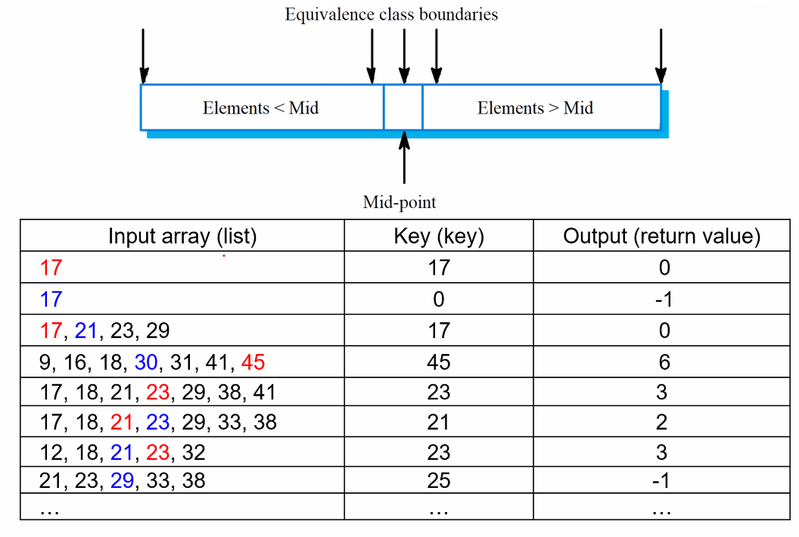
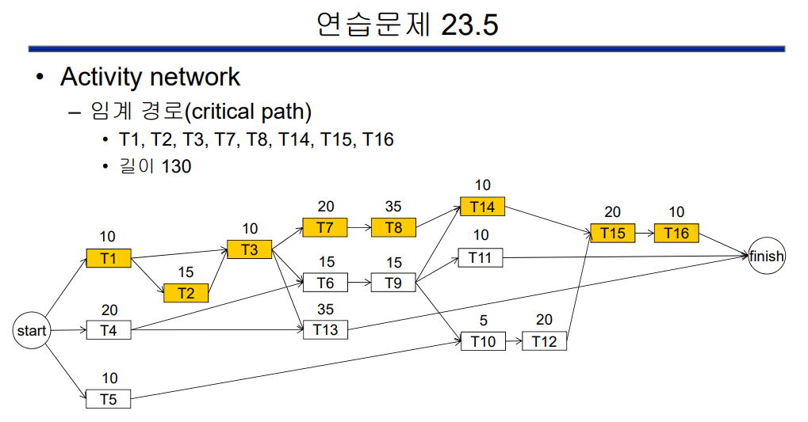

# 소프트웨어 공학

중간고사 이후

# 8장 소프트웨어 테스팅

* 테스팅의 2가지 목적
  * 프로그램이 의도대로 수행되는지 보여줌
  * 프로그램을 사용하기 전에 결함을 발견
* 프로그램 테스팅
  * 인위적인 데이터를 이용하여 프로그램을 실행시키고 실행 결과를 점검
* 테스팅은 오류의 존재를 밝힐 수 있지만 오류가 없음을 보일 수 없음
  * Testing can only reveal the presence of errors, not their absence.


* 검증 테스팅(validation testing)★ 영어 단어로 기억
  * 소프트웨어가 고객의 요구사항에 맞는지 보여줌
  * 요구사항마다 적어도 하나의 테스트가 있어야 하며 시스템이 정확하게 수행되는 것을 기대
* 결함 테스팅(defect testing)
  * 소프트웨어의 결함(버그)에 의해 제대로 동작하지 않는 경우를 찾음
  * 테스트 케이스(test case)는 결함(defect)을 드러낼 수 있도록 설계
    * 한계치를 시도해보라 그런 의미


### 검증테스팅(validation testing)과 결함테스팅(defect testing)의 차이점 ★


* validation testing의 경우에는 정상적인 데이터로, 프로그램이 의도한 대로 잘 돌아가는지 확인하는 것이고
* detect testing의 경우에는 이상한 입력을 통해서 결함을 찾아내는 것


### Verification vs Validation ★

* 소프트웨어 검증 및 확인 (V&V) 프로세서
  * Verification & Validation 영어 말로 꼭 기억하세요!!
* Validation
  * 올바른 제품을 만들고 있는가? (Right product?)
  * 고객의 기대에 맞는가? 고객에게 도움이 되는 프로그램이냐?
  * 고객이 기대하는 것을 제공하는가?
* Verification
  * 제품을 올바르게 만들고 있는가?(Product right?)
  * 소프트웨어가 요구사항 명세에 맞나?
  * **SPEC에 맞냐??**


### 인스펙션과 테스팅★

* 소프트웨어 **인스펙션**
  * 요구사항, 설계, 소스코드를 분석하고 검사해서 문제 찾음
  * 프로그램을 **실행시키지 않는** **정적(static) V&V 기술**
  * 주로 **소스코드를 대상**으로 하지만 소프트웨어의 어떤 표현이라도 검사 가능
* 소프트웨어 **테스팅**
  * 프로그램을 **실행시켜** 동작을 관찰하는 **동적(dynamic) V&V 기술**


* **인스펙션 장점**★
  * 테스팅 중에는 오류가 다른 오류들을 가릴 수 있다.
  * 정적 프로세스이므로 오류 간의 상호작용과는 무관하다.
  * 소스코드를 쫙 읽으면서 한 번에 여러 오류를 발견할 수 있다.
  * 시스템의 불완전한 버전을 검사할 수 있는데, 불완전한 프로그램을 테스트 하려면 추가 코드가 필요하다.
  * 인스펙션은 결함을 찾는 것뿐만 아니라 표준 준수, 이식성(portability), 유지보수성(maintainability)등 품질 속성을 검토할 수 있다.
  * SW 안전성(safety)이라던가. 눈으로 코드를 보는 인스펙션 과정을 통해서만 볼 수 있는 것들이 있다.
* 따라서 인스펙션(정적)과 테스팅(동적, 실행)은 상호 보완적이다.
  * 인스펙션이 테스팅을 대체할 수는 없다.
  * 시스템 컴포넌트 간 상호작용, 타이밍, 성능

#### 인스펙션의 용어에 대해서 정확히 잘 알아야 합니다★

#### 테스트 케이스에 대해서도★


### 테스트 케이스(test case) ★


* **무엇을 테스트 하는지**, **테스트 입력 - 예상 출력**
* **테스트 데이터** : 시스템을 테스트 하기 위한 **입력**
* **테스트 결과** : 테스트 데이터 입력에 따른 **출력**


* 절댓값 함수라고 하는 예시!!


#### 테스팅의 단계

* 개발 테스팅(development testing)
* 릴리스 테스팅(release testing)
* 사용자 테스팅(user testing)


#### 테스트 자동화

* 자동화된 테스팅
  * 테스트를 실행하는 프로그램 이용
  * 테스트 주도 개발(TDD)을 위해서는 자동화된 테스팅이 필수
* **회귀 테스팅(regression testing) ★**
  * 이전의 테스팅을 모두 다시 테스팅 하는 것을 말한다.
  * 프로그램의 변경으로 새로운 버그가 생기지 않았는지 점검하기 위하여 이전에 수행한 테스트를 다시 실행


## 8.1 개발 테스팅

* 개발 테스팅의 단계
  * 단위 테스팅(unit testing)
    * 함수, 클래스 등 프로그램의 단위를 테스팅
    * 단위 **기능을 테스트** 하는데 집중
    * 각각의 유닛들 기능을 테스트 하는 것!!
  * 컴포넌트 테스팅(component testing) - 다른 사람들은 **통합 테스팅** 이라고도 쓴다.
    * 단위들이 통합(integration)된 복합 컴포넌트를 테스팅
    * 컴포넌트의 **인터페이스를 테스트**하는데 집중
    * 인터페이스들의 연동을 테스트 하는 것으로, 기능들을 조금씩 붙여가면서 테스트 하는 것!!
  * 시스템 테스팅(system testing)
    * 시스템을 **전체**로서 테스팅
    * 컴포넌트의 상호작용을 테스트하는데 집중
    * 이건 전체를 다 붙여서 테스트 하자!!
* 개발 테스팅의 목표
  * 주로 버그를 발견하는 결함  테스트
  * 디버깅과 중첩됨


#### 개발 테스팅의 분류

다시 짚어보면.. 

* 단위(unit) 테스팅
  * 모듈 기능을 테스트
  * 테스트 드라이버(test driver) / 스텁(stub - 가짜 함수. 임시 함수.. 뭐 그런 것들) 필요
* 통합(integration) 테스팅
  * 모듈 간의 상호작용을 테스트
  * 모듈 통합 방법
    * 빅뱅 테스트
    * 하향식 통합
    * 상향식 통합
* 시스템(system) 테스팅
  * 시스템의 기능을 테스트
  * 요구사항이 만족되는지 테스트

* 소프트웨어 개발에서 설계, 구현, 테스팅... '나누어서 해결하라!' divide & conquer


### 8.1.1 단위 테스팅


* 잘 하라.. 하는 일반적인 지침이니 그냥 넘어가용~


### 8.1.2 단위 테스트 케이스 선정 ★

* 효과적인 단위 테스트

  * 검증 - 컴포넌트가 예상(명세, specification)대로 동작하는 것을 보임
  * 결함 - defect를 찾아야 한다.

* **테스트 케이스 선정을 위한 전략★**

  * **동등 분할(equivalence partition)★**
    * 얘는 기능에 따라 그룹을 나누기만 하면 되니까, 소스코드는 몰라도 된다. 블랙박스 테스팅
    * 공통 특성을 가진 입력 또는 출력 그룹을 식별하여 각 그룹별로 테스트 케이스를 선정
    * 그룹을 나눠서 적어도 한 개 이상씩은 테스트 케이스를 실행해야하지 않느냐!

  

  * 가이드라인 기반
    * 프로그래머가 자주 범하는 오류를 찾아내기 위한 테스트 케이스 선정
  * **코드 커버리지(code coverage)**
    * 소스 코드 중에 테스트가 된 비율. 실행된 비율.
    * 단순히 코드 몇줄이나 했냐에 대한 부분인 문장(statement) 커버리지, 결정 또는 분기(decision or branch) 커버리지, 조건(condition) 커버리지 등
    * 얘는 소스코드가 있어야 한다. 뒤에서 나올 내용인데.. 소스코드를 보면서 하는 것은 화이트박스 테스팅. 구조를 보고 하는거기 때문에 구조적 테스팅이라고도 한다. 반대는 블랙박스 테스팅.


#### 분할 테스팅 ★

* **동등 분할(equivalence partitioln)**
  * 입력 데이터 또는 출력 결과를 공통 특징을 가진 **그룹으로** 분할
    * 양수 / 0 / 음수, 자릿수, 데이터 개수 짝수개 / 홀수개, 정상 / 오류 등... 분할할 그룹은 내 맘대로!!
* **분할 테스팅(partition testing) ★**
  * 입력과 출력 분할을 식별
  * 각 분할에서 테스트 케이스를 선정한다.
  * 입력이든 출력이든 분할을 해서 각 분할에서 테스트 케이스를 적어도 하나씩은 골라라~
  * 일반적으로 분할의 양쪽 경계와 분할의 중간점을 선정한다.


이런 테스트도 해보자!! 하고 그룹으로 분할 하는거지.


* 접근 방법에는 두 가지
  * **블랙박스 테스팅** : 구체적인 코드의 내용은 보지 말자.. 다만 **스펙**만 가지고 한다.
    * 예를 들어 binarySearch 라는 함수를 테스팅 한다 하면..
    * 이것의 스펙은 [정렬 : 오름차순 / 파라미터 : 정수 배열, 키값]
    * 따라서 테스트 케이스를 효과적으로 선정할 필요가 있는데, 이것을 위해 분할 테스팅을 하는것
      * 배열이 있냐 없냐, 정렬이 되었냐 안되었냐, 키값이 배열에 있냐 없냐, 배열 원소 수가 몇개냐.. 등
      * 결론적으로, 이런 기준들을 통해서 **실제 입력 데이터와 결과까지 있는 것까지 테스트 케이스**가 된다.
  * 화이트박스 테스팅 (구조적 structural) : 구체적인 코드 내용을 안다.


#### 이진탐색 - 테스트케이스 



* 이것들이 테스트케이스. 입력 배열 / 키 값(찾으려는 값) / 출력


#### 블랙박스 테스팅 & 화이트박스 테스팅 ★

* 블랙박스 테스팅
  * 테스트 케이스를 선정하기 위하여 시스템(함수, 메소드, 모듈, 컴포넌트, 유닛, 서브시스템..)의 **명세만**을 사용
  * 코드나 시스템 내부에 대한 지식을 사용하지 않고 테스트 케이스 선정
  * 기법 : **동등 분할**
* **화이트박스 테스팅** (aka. structural testing)
  * 알고리즘, **소스코드** 등 시스템의 내부 구조를 고려하여 테스트 케이스 선정 (주로 소스코드 보고 분석)
  * 기법 : 문장 커버리지, 분기 커버리지, 단순 경로


## 테스트 관련 보조자료

### Flow graph ★

* 흐름 그래프(flow graph)

  * 프로그램 내의 경로를 보여줌

* **순환복잡도(cyclomatic complexity) ★**

  * 프로그램에 존재하는 독립적인 경로의 수 (이걸 구하여라! 하는게 나올수도!)

  

  * 경로의 조합은 고려하지 않음, 위 if문 아래 if문을 별개로 보자! 하는 것. 다 들러보자.
  * 흐름 그래프 이용 계산
    * 순환복잡도 = 간선(edge) 수 – 노드(node) 수 + 2
  * 조건의 수 이용 계산
    * 순환복잡도 = 단순 조건의 수 + 1
  * **기본 경로 테스팅(basic path testing) ★**
    * 독립적인 경로를 적어도 한 번은 거치도록 테스트 케이스를 선정
    * 아래 함수들에서 return이 a 또는 b가 있을 때의 경우, 2개의 경로. 최소한 한 번은 거쳐야 하지 않긋냐?


#### Flow graph 예제(1)


```java
public class MyClass {
	public static int larger(int a, int b) {
		if (a > b)		// 1 
			return a;	// 2
		else
			return b;	// 3
	}				// 4

	public static int abs(int a) {
		if (a >= 0)		// 1
			return a;	// 2
		else
			return -a;	// 3
	}				// 4
```

* **실수하지 않는 번호 붙이는 방법 ★ 번호를 붙여라 하는거 시험에 낼수도**
  * **조건**에는 번호를 붙인다! 그리고 조건과 실행문이 한 줄에 있지 않도록 꼭 엔터 친다..
  * **return**에도 번호를 붙인다!
  * **메소드의 맨 마지막 닫는 괄호**에도 번호를 붙인다!


```java
	public static int median(int a, int b, int c) {
		if (a <= b) {			// 1
			if (b <= c)			// 2
				return b;		// 3
			else if (a <= c)	// 4
				return c;		// 5
			else
				return a;		// 6
		}
		else {
			if (a <= c)			// 7
				return a;		// 8
			else if (b <= c)	 // 9
				return c;		// 10
			else
				return b;		// 11
		}
	}							// 12
```

* 테스팅이 필요한데, 이 때 테스트케이스가 필요할 것
* 소스코드로 하는것이므로 **화이트 박스 테스팅**. 그중에서도 **단순경로**를 하겠다.
  * 모든 경로에 대해 적어도 한 번씩 지나가도록 테스트 케이스를 선정받아야 한다.
  * 간선 수 세다가 틀릴수도 있음ㅋㅋ
  * 그래서 단순 조건(if, else if, while, for..) 수를 세서 +1 하면 경로의 개수


```java
	static int binarySearch(int list[], int key) {
		int low, high, middle;				// 1  생략 가능
		low = 0;
		high = list.length-1;

		while (low <= high) {				// 2
			middle = (low + high) / 2;		// 3  생략 가능
   			if (key == list[middle])		// 4
				return middle;			   // 5
			else if (key > list[middle])	// 6
				low = middle + 1;		   // 7
			else
				high = middle - 1;		   // 8
		}
		return -1;						  // 9
	}									 // 10
}										 // 얘는 클래스 끝나는 괄호
```

* 분기가 일어나지 않는 하나의 덩어리는 하나로 묶는다.
* whlie문도 '조건'이 나오니까 센다.
* 사실 여기서 1하고 3은 생략해도 상관 없다.


* flow chart를 그리면 이렇게 된다.
* 코드를 따라가며 '실행되는 순서대로' 그리면 실수하지 않고 잘 그릴 수 있을 듯 하다.


```java
void topologicalSort() {
   int top = 0, i, id;						   // 1  생략 가능
   int inDegree[numOfTasks];
   int *stack[numOfTasks];
   for (id=0; id<numOfTasks; id++) {			// 2  
      int numOfPred = task[id].getInDegree();	// 3   생략 가능
      inDegree[id] = numOfPred;
      if (numOfPred == 0) {					  // 4
         stack[top] = id;					  // 5
         top++;
      }
   } // end for
   for (i=0; i<numOfTasks; i++) {			   // 6
      top--;								 // 7
      id = stack[top];
      topOrder.push_back(id);
      Edge *e = task[id].getSucc();
      while (e) {							 // 8
         int succId = e->getSuccTask();		   // 9
         inDegree[succId]--;
         if (inDegree[succId] == 0) {		   // 10
            stack[top] = succId;			  // 11
            top++;
         }
         e = e->getSucc();					  // 12
      } // end while
   } // end for
}										    // 13
```

* **주의할 부분**. 반복문 안에 분기에서, 반드시 다시 반복문으로 돌아왔다가 종료가 된다.
  * 4번이나 5번에서 끝나면 6번이 아니라 반드시 2번으로 간다.
  * 마찬가지, 8번이 끝나면 반드시 6번 for문으로 간다.
  * 직접 그려보자. 이건.ㅎㅎ


#### **Cyclommatic Complexity**

* 추가 설명


* '단순 조건'에 대해서만 문제 낼 것이니.. ^_^ 게다가 복합 조건도 단순 조건으로 변환시킬 수 있다~ &&를 if문 여러개로..
* 반복문 분기에서 주의할 점은, 시작 노드와 끝 노드가 같다 하는 것!! ★


### Junit & EclEmma


### 인텔리제이에서 Junit 테스팅 실습

#### JUnit test case (1)


```java
public class MyClassOtherTest {
	@Test public void testLarger1() {
		assertEquals(MyClass.larger(1, 2), 2);
	}
	@Test public void testLarger2() {
		assertEquals(MyClass.larger(2, 1), 2);
    }
	@Test public void testAbsPositive() {
		assertEquals(MyClass.abs(1), 1);
    }
	@Test public void testAbsZero() {
		assertEquals(MyClass.abs(0), 0);
    }
	@Test public void testAbsNegative() {
		assertEquals(MyClass.abs(-1), 1);
	}
}
```

* 코드 커버리지로 저렇게 볼 수 있다.
* 모든 코드의 커버리지를 초록색으로 만들어서 모든 케이스를 테스트하는 것이 목적!!


#### JUnit test case (2)


```java
public class MyClassMedianTest {
	@Test public void allSame() {
		assertEquals(MyClass.median(1, 1, 1), 1);
	}
	@Test public void twoSame1() {
		assertEquals(MyClass.median(1, 1, 2), 1);
	}
	@Test public void twoSame2() {
		assertEquals(MyClass.median(1, 2, 2), 2);
	}
	@Test public void notSame() {
		assertEquals(MyClass.median(1, 2, 3), 2);
	}
}
```

* 얘도 마찬가지.
* 테스트 케이스들을 다 잘 만들어보자.


#### JUnit assert example (1, 2)

```java
public class AssertTests {
    @Test public void testAssertArrayEquals() {
        byte[] expected = "trial".getBytes();
        byte[] actual = "trial".getBytes();
        assertArrayEquals("failure - byte arrays not same", expected, actual);
    }
    @Test public void testAssertEquals() {
        assertEquals("failure - strings not same", 5l, 5l);
    }
    @Test public void testAssertTrue() {
        assertTrue("failure - should be true", true);
    }
    @Test public void testAssertFalse() {
        assertFalse("failure - should be false");
	}

	@Test public void testAssertNull() {
        assertNull("should be null", null);
    }
    @Test public void testAssertNotNull() {
        assertNotNull("should not be null", new Object());
    }
    @Test public void testAssertSame() {
        Integer aNumber = Integer.valueOf(768);
        assertSame("should be same", aNumber, aNumber);
    }
    @Test public void testAssertNotSame() {
        assertNotSame("should not be same Object", new Object(), new Object());
    }
}
```

* assert 문들이 다양하게 제공 된다~ 하는 것들 예시.


#### 예제 프로젝트 생성

* Eclipse에서 MyProject 프로젝트 생성
  * MyClass 클래스 생성
    * 둘 중 큰 정수를 반환하는 larger() 메서드
    * 정수의 절대값을 반환하는 abs() 메서드
    * 세 정수 중 중간값을 반환하는 median() 메서드
    * main 메서드 작성 필요 없음


## 과제!! 이런..


* 공백을 없애버릴 것인지? 그 스펙을 올려주면, 그에 따라서.. 블랙박스로..
* 테스트케이스들을 작성 하고, 그에 대한 나눈 이유를 같이 작성해야 해.

* 1번은 내가 생각하는 기준으로 동등 분할을 찾아 나눠보아라 하는 것.
  * '공백'은 space, tab. new라인은 새 줄이므로 취급 X
  * '공백문자로 바꿔주는'은 space
  * 공백 위치, 공백 없는것, 공백 하나, 공백 둘, 공백 셋, 공백 열개, 엔터
  * 이런식으로 각 집합별로 테스트 내용에 대한 '설명'이 필요하다!! 어떤 기준으로 나누었는지 등
  * 입력 동등분할 / 출력 동등분할 / 스펙에 의한 동등분할 등..
  * 코드 내용 보지 않음.
  * 커버리지 생각하지 않음.
  * 그래서 TestCase 클래스를 만들어서 '실행' 시킨 결과를 보라~
* 2번은 코드를 보고, 기본경로 테스팅을 하라~
  * 전부 초록색으로 나오도록 하라는 것.
  * 각자 번호는 붙여라 하는 것!!?
  * @Test 가 기본 경로만큼 최소한 있어야 한다는 거여~


## 다시 테스팅 이론으로 돌아와서

### 테스트 가이드라인

* 시퀀스(배열, 리스트 등) 테스팅 지침
  * 원소가 하나인 시퀀스로 테스트
  * 테스트마다 서로 다른 크기를 가지는 시퀀스 사용
  * 시퀀스의 첫 번째, 중간, 마지막 원소를 접근하도록 테스트
  * 길이가 0인 시퀀스(원소가 없는)로 테스트
* 일반적인 지침
  * 모든 오류 메시지가 생성되도록 입력값을 선택
  * 버퍼 오버플로우가 일어나도록 입력을 선정
  * 같은 입력 또는 같은 입력 순서를 여러 번 반복
  * 유효하지 않은 출력이 생성 되도록 함
  * 계산 결과를 너무 크거나 너무 작게 되도록 함
    * 즉, **일부로 오류를 만들거나 이상한 상황을 만들어서 시도해보고 테스트 해보라!**


### 8.1.3 컴포넌트 테스팅

지금 Unit 테스트는 다 끝났고, 이제 걔들끼리 인터페이스가 잘 되는지를 보는 통합 테스팅을 말한다!

* 컴포넌트 테스팅 (통합 테스팅)
  * unit  테스트들을 모아서 추가해가며 하는 테스팅!!
  * (복합) 소프트웨어 컴포넌트는 상호작용하는 객체들로 구성
  * 컴포넌트의 테스팅은 컴포넌트의 **인터페이스를 테스트**하는데 중점
    * **개별 객체의 단위 테스트는 완료**되었다고 가정
    * 컴포넌트 인터페이스 오류는 복합 컴포넌트를 구성하는 다시 짚어보면..  오류에 기인
  * 인터페이스 유형
    * 매개변수(parameter) - 우리가 접하는 대부분은 이걸 쓸 것
    * 공유메모리(shared memory) 인터페이스
      * 타이밍 문제, 동기화 관련 Issue가 훨씬 많을 것이여.
    * 프로시저 인터페이스(porcedure)
    * 메시지 전달(message passing) 인터페이스


* top-down 방식, 위에서 아래로 붙여나가는거
* bottom 방식, 아래에서 위로 붙여나가는거
* 그 때 stub이 있어야 한다고 했다. 이건 복습. 위에 다시 찾아보자.

통합 테스팅, 시스템 테스팅은 블랙박스 테스팅을 해야 겠지요.. 라고 말씀하심.


### 인터페이스 에러들

* 인터페이스 오용(misuse)
  * 호출 사용법 관련 오류
  * 예 : 매개변수 유형 오류, 매개변수 순서 오류 등
* 인터페이스 오해(misunderstanding)
  * 인터페이스 명세를 잘못 이해
  * 예 : 이진 탐색 함수에 정렬되지 않은 배열을 전달
* 타이밍(timing)오류
  * 공유 메모리나 메시지 전달 인터페이스를 사용하는 경우 일어남
  * 예 : 생산자 / 소비자의 속도 또는 타이밍 오류
    * XML Web service..


### 인터페이스 테스팅 가이드라인 ★

* 인터페이스 오류를 발견하기 위한 테스팅 지침
  * 매개변수 값이 범위의 극단(경계)에 있게 테스트를 설계
  * 포인터나 레퍼런스를 사용할 경우 널 객체가 전달되는 경우를 테스트
  * 고의적으로 컴포넌트가 **실패하도록** 테스트를 설계
  * 메시지 전달 시스템에서 **스트레스(stress) 테스팅 ★**을 사용
    * 엄청 많은 메시지를 보낸다든지.. 원래 설계보다도 더 큰 부하를 주는 방법을 말한다.
    * 타이밍 문제를 발견하는 효과적인 방법!
  * 공유 메모리를 이용하는 경우 컴포넌트들이 활성화되는 순서가 바뀌도록 테스트를 설계
* 인터페이스 오류를 찾는데 인스펙션(inspection)이 더 효과적일 수 있음
  * 인스펙션 : 정적 V&V / 테스팅 : 동적 V&V

일부로 결함(defect)을 발견하도록, 이상한 값으로 테스트 케이스를 만드는게 일반적인 가이드라인..


### 8.1.4 시스템 테스팅

* 시스템 테스팅
  * 재사용 컴포넌트, 기성품 시스템, 다른 팀에서 개발한 컴포넌트를 통합하여 완전한 시스템을 테스트
  * 전체를 테스트 하는거야!!
* 시스템 구성요소들의 상호작용을 테스팅하는데 중점
  * 시스템의 창발적(emergent) 특성을 테스트
  * 계획된 창발적 행동 / 예기치 못한 창발적 행동
* 유스케이스 기반 테스팅이 효과적
  * 요구사항에서 작성한 유스케이스 시나리오 → 시스템 테스팅에 이용
  * 유스케이스 시나리오 표현 : 시퀀스 다이어그램, 액티비티 다이어그램, 자연어 등
  * 기본(basic) 흐름, 대안(alternative) 흐름, 예외(exceptional) 흐름을 고려

앞에서 검증(validation) 테스팅!


## 8.2  테스트 주도 개발

### 테스트 주도 개발(TDD)

* 테스팅과 코드 개발이 중첩되어 있음
* 점증적인 접근법으로 증분(increment)의 테스트를 작성하고 코드를 개발
* 즉, 증가분에 대해 반복적(iterative)이고 점증적(incremental)으로 테스팅 하라는 거!!
* 애자일 기법인 XP에서 시작됨
  * 테스트 우선 개발, Test First Development


### TDD 프로세스 단계

1. **증분**을 위한 기능 식별
2. **테스트를 작성**하여 자동화된 테스트로 구현
3. 이전의 모든 테스트와 함께 추가한 테스트를 실행(실패)
4. 증분의 기능을 **구현**하고 테스트를 다시 실행
5. **모든 테스트**를 통과하면 다음 증분을 개발
   * 모든 테스트 : 이전 증분을 위한 테스트 포함, 이때까지 한 거 다 돌려라.
   * 위에서 **회귀 테스팅(regression testing)**이라고 했었음 ★


### 테스트 주도 개발의 장점

* 코드 커버리지(code coverage) : 모든 코드와 연관된 테스트가 있음
* 회귀 테스팅(regression testing) : 모든 테스트를 실행
* 단순화된 디버깅 : 문제를 지역화하기(localize) 쉬움
* 시스템 문서화 : 테스트를 보면 코드를 이해하기 쉬움


### 회귀 테스팅 ★

* 시스템을 변경한 후 변경과 관련된 테스트 뿐만 아니라 기존에 성공한 이전의 모든 테스트를 다시 실행하는 것
* 변경으로 인하여 새로운 버그가 생기지 않았고 새로운 코드가 기존 코드와 문제없이 동작하는지 검사
* JUnit 등 자동화된 테스팅 필요


## 8.3 릴리스 테스팅

* 단위 - 단위
* 통합 - 컴포넌트(인터페이스)
* 시스템 - 시스템 / 릴리스

* **릴리스 테스팅은** 시스템 테스팅의 한 형태
* 릴리스 테스팅과 시스템 테스팅의 구분
  * 개발팀이 아닌 별도의 팀이 테스팅 해야함
  * 시스템이 **요구사항**을 만족시키는 것을 점검 (**검증 테스팅(validation) 위주★**) 
  * 시스템이 사용하기에 충분하다는 것을 확인
  * 시스템 테스팅은 결함 테스팅에 중점 (꼭 그런것만은 아니다. 아무래도 시스템은 덜 완성된거다보니 결함찾기..)
* **블랙박스 테스팅** 프로세스
  * 테스트 케이스를 **시스템 명세**(요구사항 - 기능적, 비기능적)를 이용하여 작성
  * 시스템의 기능만 고려하고 구현은 고려하지 않음


### 8.3.1 요구사항 기반 테스팅 & 8.3.2 시나리오 테스팅

* 요구사항 기반 테스팅

  * 검증 테스팅

  * 추적가능성(traceability) 기록 관리

    * 아래 그림의 저 화살표들을 알 수 있다. 추적 가능성! md파일 1에서 다시 찾자

    

* 시나리오 테스팅

  * 시스템을 사용하는 전형적인 시나리오
  * 유스케이스 시나리오
  * 한 시나리오 내에서 여러 요구사항을 테스팅 → 요구사항의 조합 점검


### 8.3.3 성능 테스팅 ★

* 성능 테스트
  * 시스템의 운영 프로파일을 반영하여 **트랜잭션 유형**의 비율에 따라 테스트
  * 시간 당 처리량(throughput, Transaction per second : TPS), 응답 시간(response time) 등을 측정
    * 예를 들어 **수강신청**이라 하면
    * 2/3학년이 10시~10시10분까지 전쟁 몇명? 몇 과목 추가? 삭제 몇 개?
    * '피크타임'에 시간이 얼마나 걸리는지, 요청이 얼마나 되는지 처리에 대한 부분.
* **스트레스 테스팅(stress testing) ★** 
  * 시스템의 최대 설계 부하를 초과하는 요청을 생성하여 테스트
* 스트레스 테스팅의 **목적**
  * 시스템의 장애 행동을 관찰
  * **시스템의 결함(defect)을 발견**하는데 좋은 접근 방법


## 8.4 사용자 테스팅

* 릴리즈 테스팅 후에도 사용자 테스트는 필수적이다.
  * 사용자 운영환경이 시스템의 신뢰성, 성능, 사용성, 견고성 등에 영향

### 사용자 테스팅의 유형

* 알파 테스팅(alpha testing)
  * 사용자가 개발자와 함께 **개발자 사이트**에서 테스트
  * 현실적인 테스트를 설계할 수 있도록 사용자들이 정보 제공
* 베타 테스팅(beta testing)
  * **고객 또는 큰 규모의 사용자 그룹**이 시스템을 사용해보고 문제점 피드백
  * 다양한 설정과 운영 환경에서 사용되는 시스템을 테스트하는데 효과적
* 인수 테스팅(acceptance testing)
  * 시스템의 인수를 결정하기 위해 고객의 환경에서 고객의 데이터를 이용
  * XP에서는 별도의 인수 테스팅이 없을 수도 있음


# 9장 소프트웨어 진화 (Evolution)

* 유지보수
  * 문제점 fix
  * 기능 추가
  * 기능 변경
  * maintenance 하지 않으면 == Evolution 하지 않으면, 더이상 수명이 다한 프로그램이다 라는 뜻


### 소프트웨어 변경 

* 소프트웨어 변경은 불가피하다
  * 소프트웨어를 사용하면서 새로운 요구사항이 생김
  * 변화하는 비즈니스 호나경에 적응
  * 운영 중 발견된 오류를 수정
  * 하드웨어와 소프트웨어 플랫폼이 변화
  * 성능이나 신뢰성 등 비기능적 특성 개선
* 소프트웨어 진화의 중요성
  * 조직의 소프트웨어는 중요한 비즈니스 자산
  * 자산의 가치를 유지하기 위해서는 변경이 필요함
  * 대규모 기업은 기존 시스템 유지보수에 더 많은 비용을 지출(소프트웨어 비용의 60% 이상이 진화 비용)


## 9.1 진화 프로세스

* 진화 프로세스는 소프트웨어의 유형, 조직 소프트웨어 개발 프로세스, 관여 사람의 기술이나 경험의 영향을 받는다.
* 변경 제안(change proposals)이 시스템 진화를 주도
  * 변경 요청(change reqeusts)이라고도 함
  * 구현되지 않은 기존 요구사항, 새로운 요구사항, 버그 보고, 개선을 위한 새로운 아이디어 등을 기반
  * 변경 제안을 받아들이기 전 변경해야 하는 컴포넌트를 분석, 변경 비용 및 변경의 영향을 추정할 수 있음
* 변경 식별 및 진화 프로세스는 시스템의 일생 동안 계속됨


* 시스템 진화 프로세스


### 변경 구현

* 개발과 진화가 통합되어 있는 경우
  * 변경 구현은 개발 프로세스의 반복 (iterative 반복적, incremental 점증적)
* 개발과 진화가 다른 팀에 의해 수행될 때
  * 구현을 위해 프로그램 이해 단계 필요
  * 프로그램 구조와 제안된 변경이 프로그램에 미치는 영향을 이해
* 요구사항 명세와 설계 문서를 수정
  * 새로운 요구사항을 기록, 분석, 확인해야 함
    * [요구사항 - 설계 - 구형 - 시험 - 운영]
      * 문서	문서
    * 결국 이 과정의 반복 아니겠나. 근데 현실적으로 문서를 수정하는건 어렵지ㅠㅠ
  * UML 모델 등 설계 문서를 수정해야 함
* 변경 요구는 긴급하게 해결해야 하는 경우가 있음
  * 요구사항과 설계를 수정하지 않고 프로그램을 긴급하게 수정
  * 요구사항, 설계, 코드가 일치하지 않게 되는 결과 초래


### 애자일 메소드와 진화

* 애자일 방법과 진화
  * 애자일 방법은 점증적인 개발이므로 개발과 진화가 매끄럽게 연결됨 (설계와 구현~. 문서 최소화~.)
  * 진화는 잦은 시스템 릴리즈를 기반으로 하는 개발 프로스세스의 연속으로 생각될 수 있음
  * 테스트 주도개발(TDD)과 자동화된 회귀 테스팅(regression testing)은 시스템 변경이 있을 때 유용
  * 시스템 변경은 사용자 스토리(user stroies)로 표현할 수 있음
  * 고객의 참여는 변경 사항의 우선 순위를 정하는데 도움이 될 수 있음
  * 수행되어야 할 작업 목록에 초점을 맞추는 스크럼(Scrum) 접근법은 변경 사항의 우선 순위를 정하는데 도움이 됨


## 9.2 레거시 시스템 ★

* **레거시 시스템** : 더 이상 사용되지 않는 언어와 기술에 의존하는 **옛날 기존 시스템 ★**
* 구성 요소
  * 시스템 하드웨어
  * 지원 소프트웨어
    * OS, 유틸리티, 컴파일러 등
  * 애플리케이션 소프트웨어
    * 다른 시기에 개발된 여러 개의 프로그램으로 구성
  * 애플리케이션 데이터
    * 막대한 양의 데이터가 존재할 수 있음
    * 일관성이 없고 중복, 여러 데이터베이스에 걸침
  * 비즈니스 프로세스
    * 레거시 시스템의 기능에 의해 제약을 받음


### 레거시 시스템 교체

* 레거시 시스템의 문제점 
  * 기술(자)부족 : COBOL 프로그래머
  * 보안 취약점 : 인터넷 활용 이전 개발
  * 인터페이스 문제 : 최근의 프로그래밍 언어 시스템과의 인터페이스
  * 하드웨어 유지보수 문제 : 유지보수 비용이 증가
* 레거시 시스템을 교체하지 않는 이유
  * 교체 비용 많이들 수 있음
  * 교체 리스크 큼
  * 레거시 시스템이 효과적으로 작동 (?ㅋ)
* 레거시 시스템 교체가 비용이 많이 들고 리스크가 높은 이유
  * 완전한 명세서가 없고 시스템의 변경 사항이 반영되어 있지 않음
  * **비즈니스 프로세스**와 **레거시 시스템**이 밀접하게 얽혀 동작함 (비즈니스 프로세스는 SW시스템에 **종속적**)
  * 중요한 비즈니스 규칙이 소프트웨어 안에 내장되어 있고 문서화 되어있지 않음
  * 새로운 소프트웨어 시스템 개발은 리스크가 높으며 예상치 못한 문제가 발생할 수 있음, 개발이 오래 걸리고 예산을 초과할 수 있음

* 현장의 문제

  * 새로운 SW 시스템을 개발 하기 위해.. 비즈니스 관련 모델들은 다음과 같은 일을 선행한다.

  * ISP 정보전략계획

    => BPR (Biz Process Reenginerring)

    => 기존의 일하는 방식이나 방법 등을 개선하는 그런 거에 맞춰서 요구사항을 만들고 개발을 한다.


### 9.2.1 레거시 시스템 관리

* 레거시 시스템 진화 선택
  * 시스템의 완전한 폐기
    * 비즈니스 프로세스가 변경되어 레거시 시스템이 의존하지 않을 때
  * 정기적인 유지보수를 계쏙
    * 시스템이 필요하고 안정적이며 변경 요청이 거의 없을 때
  * 유지보수성을 향상시키기 위해 **시스템 재공학**
    * 변경에 의해 시스템 품질이 저하되었지만 새로운 변경이 필요한 경우
    * 뒤에서 나오겠지만 시스템 재공학은 좀 더 큰 범위에서의 변경.. **reengineering**은, 전체 구조를 뜯어 고치겠다는 것
    * 앞서 배운 **refactoring**은 **소스코드**라는 좀 더 작은 범주에서, 클래스를 바꾼다거나 하는 등의 수준.
  * 시스템 전체나 일부를 새로운 시스템으로 대체
    * 하드웨어 등의 요인으로 이전 시스템을 사용할 수 없을 때나 기성품 시스템을 이용하여 합리적인 비용으로 새로운 시스템을 개발할 수 있을 때
* 레거시 시스템 구분
  * 낮은/높은 품질
  * 낮은/높은 비즈니스 가치


## 9.3 소프트웨어 유지보수

* 결함 수리(fault repair)
  * 버그와 취약점을 고침
* 환경 적응(environmental adaptation)
  * 새로운 플랫폼과 환경에 맟추기 위한 적응
* 기능성 추가(Functionality addition)
  * 새로운 기능을 추가하고 새로운 요구사항을 지원
  * 현장에서의 유지보수라 하면, 기능 추가나 변경이 제일 많다.
  * 아래 사진처럼 유지보수 비용은 계속 많다...


### 유지보수의 종류 ★ 시험 나올 수도 있는 이야기~

* 기존 유지보수 유형 종류
  * 수정 유지보수(corrective maintenance)
    * 결함 수리
  * 적응 유지보수 (adaptive maintenance)
    * 새로운 환경, 새로운 요구사항에 적응
    * 새로운 환경에 적응시키는 것
  * 완전 유지보수 (perfective maintenance)
    * 새로운 요구사항 구현 또는 시스템의 구조와 기능 개선
    * 요구사항을 완전하게 만든다. completence 완전성...
  * 예방 유지보수 (preventive maintenance)
    * 장래 변경 시 발생할 수 있는 문제를 감소시킴
    * 문제가 생길 가능성을 줄이는 것


### 유지보수 비용

* 유지보수 과정에서 기능을 추가하는 것이 개발 과정에서 구현하는 것보다 비용이 더 많이 듦
  * 새로운 팀이 유지보수되는 프로그램을 이해해야 함
  * 유지보수와 개발의 분리는 개발 팀이 유지보수하기 쉬운 소프트웨어를 작성할 유인이 없음
  * 프로그램 유지보수를 좋아하지 않음
  * 프로그램이 오래될수록 구조가 저하되고 변경이 어려워짐
* 문제의 원인과 해결
  * 많은 조직들이 개발과 유지보수를 별개 활동으로 간주, 시스템이 개발 프로세스에서 계속 진화해 나간다고 생각해야 함
  * 반복되는 수정에 의해 구조가 망가짐, 소프트웨어 재공학과 리팩토링을 적용


### 9.3.1 유지보수 예측 - 빨리빨리 통과합시다 시험에 안내 ㅋㅋ


* 하여튼 고치기 어렵고 복잡하면 유지보수성이 떨어진다.
* 변경할라 하니까 골치가 아프더라..


### 9.3.2 소프트웨어 재공학 ★

* **소프트웨어 재공학(Sofeware reengineering) ★**
  * 시스템의 전체 또는 일부를 재구조화 하거나 다시 작성하는 것
  * 기존 시스템의 기능을 변경하지 않고 시스템을 유지보수하기 쉽고 이해하기 쉽게 함
  * 문서화, 아키텍처 개선, 프로그래밍 언어 변환, 데이터의 구조와 값 수정 등
  * **즉, 똑같은 기능을 하는 시스템인데, 그것을 재구조화 한다고 생각하면 된다!** 좀 더 큰 범위.
* **재공학의 활동**
  * 소스코드 변환 : 최신 버전이나 다른 언어로 변환
  * **역공학(reverse engineering) ★** : **프로그램을 분석하고 정보를 추출**
    * **소스코드로부터 설계와 요구사항 등을 뽑아내겠다 하는 것**
    * 반복적인 개발일 때는 무조건 하게 된다. 언제든지 자주 할 수 있는 질문.
    * 우리도 프로젝트 할 때 개발하고 문서화 할 때 쓰니까 ㅋㅋㅋ
    * 뭐.. 실행 코드로부터 설계나 소스코드 등을 뽑아낼 수 있는 것도 포함이긴 함
  * 프로그램 구조 개선 : 프로그램 제어 구조의 개선
  * 프로그램 모듈화 : 중복성 제거 및 아키텍처 변환
  * 데이터 재공학 : 데이터베이스 스키마 재정의, 데이터 정리


### 9.3.3 리팩토링

* **리팩토링** (이 뭔지만 알면 되겠다~)
  * 변경에 따른 품질 저하를 늦추기 위하여 프로그램(**소스코드**)을 개선하는 것
  * 구조를 개선하고 복잡도를 줄이고 이해하기 쉽도록 프로그램을 수정
  * 리팩토링에서는 프로그램의 기능을 추가하지 않으며 개선에 집중함
* 애자일 개발과 리펙토링
  * 품질 저하를 방지하기 위해 잦은 리팩토링 필요
* 재공학과 리팩토링
  * 재공학은 일정기간 유지보수 후 유지보수 비용이 증가하고 있을 때 수행, '시스템'을 뜯어 고치는 큰 범주
  * 리팩토링은 개발과 진화 과정 전반에 걸친 연속적인 개선 프로세스, '소스코드'를 수정하고 변경하는 범주


### 'Bad smells' in program code


# 10장 확실성 있는 시스템(Dependable Systems)

가장 지루한 부분...


### 시스템 확실성 (System dependability)

* 소프트웨어 시스템을 신뢰할 수 있어야 함. 믿고 쓸 수 있으려면 아래 요소들을 만족해야 하지 않겠냐?
* 확실성
  * **가용성(availability), 신뢰성(reliability), 안전성(safety), 보안성(security)** 등의 **시스템 특성들** ★
  * 프로그램을 사용하기 전에 결함을 발견
* 확실성이 중요한 이유
  * 시스템 장애가 많은 사람들에게 영향
  * 신뢰할 수 없고 보안성이 없는 시스템은 사용 불가
  * 막대한 시스템 장애 비용
  * 시스템의 정보 손실로 인한 피해
* 중대한 시스템 (critical system)
  * 시스템 장애가 사람이나 환경에 피해를 주거나 큰 경제적 손실을 줄 수 있는 시스템
  * 안전성 중심 시스템, 임무 중심 시스템, 비즈니스 중심 시스템
  * 
* 확실성이 높지 않아도 유용한 소프트웨어도 있음.
  * 인공위성 쏘거나.. 뭐 그런것들 있자나. 
* 장애의 원인 (causes of failure) 실패, 장애
  * 하드웨어 장애 : 부품 고장, 물리적 환경, 부품 수명
  * 소프트웨어 장애 : 명세 오류, 설계 오류, 구현 오류
  * 운영 시의 장애 : 의도하지 않은 방법으로 시스템을 사용


## 10.1 확실성의 특성들 ★

중요하대요.. ★

* **가용성 (availability) ★** 
  * 어떤 **시점**에 시스템이 작동(서비스를 제공)할 확률
* **신뢰성 (reliability) ★**
  * 주어진 **기간**동안 시스템이 (정확하게) 서비스를 제공할 확률
  * 다시 말해, 그 기간동안 고장이 안날 확률
    * 정확성(correctness), 정밀성(precision), 적시성(timeliness) 포함
* **안전성 (safety) ★**
  * 시스템이 **사람** 또는 **환경**에 피해를 입히지 않을 확률
  * 요즘 강조되고 있는 부분
* **보안성 (security) ★**
  * 시스템이 (우연한 / 의도적인) **침입**을 막을 수 있는지
    * 무결성(integrity) 코드나 데이터를 위변조 못하게 막는것
    * 기밀성(confidentiality) 데이터를 빼가지 못하게 하는 것
* **복원성 (resilience) ★**
  * 시스템이 장비 고장, **공격** 등 아래에 중요한 서비스를 잘 유지하는지
  * 고장이 안나는 시스템은 없다. 근데 만약 공격 등이 있을 때 얼마나 잘 유지하는지


### 다른 확실성의 특성들

* 수리가능성 (repairability)
  * 시스템이 얼마나 빨리 수리될 수 있는지
  * 가용성과 관련
* 유지보수성 (maintainability)
  * 새로운 요구사항을 수용하기 위한 시스템 변경이 용이한지
* 오류 내성 (error tolerance)
  * 사용자 입력 / 조작 오류를 방지하고 감내할 수 있는지
  * 사용성(usability)과 관련


### 비용/확실성 커브

* 결함 내성 (fault tolerance)
  * 결함이 있어도 시스템이 서비스를 계속 제공할 수 있는 능력
  * 잘못된 상태를 감지하고 장애가 발생하기 전에 복구하는 코드 필요


* 뭐 당연한 이야기. 확실성이 낮은데서 조금 올리는덴 비용 얼마 안들지만.. 높을 때 더 올리긴 비용 더 많이 든다!!


생략~~


## 10.3 중복성과 다양성 ★

* 고려사항

  * 시스템 컴포넌트의 장애는 피할 수 없다.
  * 결론은 컴포넌트의 장애가 시스템 전체 장애로 이어지지 않도록 시스템을 설계해야 한다!
    * 시스템 전체 장애 : 서비스 제공 불가!! 상황
    * 그럼 서버를 여러 대 두는 방법은 어떤가?

* **중복성 (redundancy) ★**

  * 시스템 컴포넌트의 장애가 일어났을 때 사용할 수 있는 여분의 기능을 시스템에 포함시킴

  * 만일에, 사용자 request가 들어왔다 치자. 중복성을 이용해서 두 개의 서버로 나누어서 처리하는 구조
* 동일한 SW, 동일한 HW... 동일한 오류...
  * 그럼 1번이 죽으면 2번도 죽을 수도!?!?
  
* **다양성 (diversity) ★**

  * 같은 방식으로 실패하지 않도록 서로 다른 중복 컴포넌트를 사용

* 중복성과 다양성 예

  * 가용성을 높이기 위해 중복된 서버 사용
  * 서로 다른 유형의 서로 다른 운영체제의 서버를 사용

* 확실성을 위해 설계된 시스템은 중복 컴포넌트를 포함

  * 주 컴포넌트가 실패하면 중복 컴포넌트로 전환
  * 중복 컴포넌트가 다양하면 컴포넌트의 공통 결함이 시스템 장애로 이어지지 않음
  * 시스템의 상태를 검사하고 복구하는 코드를 포함시킬 수 있음
    * 복잡도↑ => 문제↑

* 문제점

  * 중복성과 다양성의 도입에 따라 버그가 생길 수 있음
  * 컴포넌트 장애를 감지하고 다른 컴포넌트로 전환하는 기능이 있어야 하므로 시스템의 복잡도가 올라감
  * 중복성과 다양성을 피하는 것이 낫다는 주장이 있음
    * 결함 없애려다가 복잡도가 올라가서 결함이 또 생기는 일이 생기니까.. 그냥 단순 코드로 하는게 낫다는 주장

중복성과 다양성이 둘 다 필요하다~... 하는 것이여


### 확실성 있는 프로세스 ★

* **확실성 있는 프로세스의 특징**
  * **명시적으로 정의(explicitly defined)**
    * 중대한 시스템의 경우에는 SW process를, 절차를 구체적이고 상세하게 정의해야!!
    * 누가 봐도 딱 알 수 있도록 명시적으로 정의를 해야한다는...
  * **반복 가능(repeatable)**
    * 누가 하던지 간에 그 프로세스가 반복될 수 있어야한다!!
* 명시적으로 정의된 프로세스
  * 정의된 프로세스 모델이 있음
  * 개발팀이 프로세스를 준수했다는 데이터가 수집되어야 함
* 반복 가능한 프로세스
  * 개인의 해석과 판단에 의존하지 않는 프로세스
  * 누가 개발에 참여하는지에 관계 없이 프로세스가 반복될 수 있어야 함
* 확실성 있는 프로세스의 활동
  * 요구사항 검토
  * 요구사항 관리
  * **정형 명세** 
    * formal한.. 수학적, 논리적 모델을 만들어야
    * spec... 증명
  * 시스템 모델링
  * 설계 및 프로그램 인스펙션
  * 정적 분석
  * 테스트 계획 수립 및 관리
* 잘 정의된 품질 관리 및 변경 관리 프로세스가 필요
* 확실성 있는 소프트웨어 개발에 애자일 방법 사용을 고려
  * 주로 계획 기반 Plan-driven 프로세스를 이용
  * 즉, 확실성 있는 SW 개발에서는 애자일 방법보다는 계획 기반 프로세스를 


# 11장 신뢰성 공학 (Reliability engineering)

### 시스템 신뢰성 ★

* 사회의 많은 측면이 소프트웨어 시스템에 의존
  * 중대한 시스템은 신뢰성 요구사항이 매우 높음
  
* **결함-오류-고장(fault-error-failure) 모델 ★**
  * 사람의 오류 또는 실수(human error or mistake)
    * 시스템 결함이 생기게 하는 사람의 행동
    * 즉, 사람의 실수(사용자 또는 개발자)로 버그를 만드는 것. 코딩 실수라든가.
    * 그러면서 시스템 오류 상태에 들어간다.
    
  * **시스템 결함(system fault)**
    * 시스템 오류로 이어질 수 있는 시스템의 특성
    * 버그로 인해서...
  * **시스템 오류(system error)**
    * 예기치 못한 시스템 행동으로 이어질 수 있는 시스템의 잘못된 상태
    * 시스템이 잘못된 상태인것이지, 지금 이 상태가 서비스 제공을 못하거나 프로그램이 아예 죽었다던가 하는 상태인 것은 아니다.
  * **시스템 장애(system failure)**
    * 사용자가 기대하는 서비스를 시스템이 제공하지 못하는 특정 시점의 사건
    * 결론적으로, 장애를 막는 것
    * 이 상태가 바로 서비스를 제공하지 못하는 상황. 죽어버렸다거나..
    
  * 시스템 결함이 반드시 시스템 오류를 초래하지는 않고, 시스템 오류가 반드시 시스템 장애를 초래하지는 않는다.
  
    * 반드시 모든 코드가 실행되는 것은 아니기에
    * 오류는 일시적이기 때문에
    * 시스템이 결함 감지 및 매카니즘을 포함할 수 있기 때문에


### 신뢰성의 achievement ★

* **결함 회피(fault avoidance)**
  * 설계 및 프로그래밍 오류를 피하는 소프트웨어 개발 방식으로 시스템에 도입되는 결함을 최소화함
  * 강한 자료형 언어(Ada..) 사용, 포인터와 같은 오류가 발생하기 쉬운 요소 사용 최소화
    * 즉, 사람이 실수할 가능성을 원천적으로 줄이자는 목적! 버그를 안생기게 하겠다는 목적
* **결함 감지 및 정정(fault detection & correction)**
  * 검증 및 확인(verification & validation) 프로세스를 통해 결함을 발견하고 제거함
    * 스펙에 맞냐 & 유용한 것이냐
  * 체계적인 테스팅, 디버깅, 정적 분석(인스펙션)
    * 즉, 여러 V&V 방식들을 통해서 결함을 발견하고 없애자는 목적! 버그를 잡겠다는 것. 하지만 그럼에도 결함은 존재한다.
* **결함 내성(fault tolerance)**
  * 실행 중에 결함이나 시스템의 예기치 못한 행동을 감지하여 시스템 장애가 일어나지 않도록 시스템을 설계
  * 결함내성 아키텍처
  * 즉, 결함이 만들어진 것을 찾아도 결함은 존재하니까.. 결함이 있더라도 시스템이 서비스를 제공하는 상태를 유지하도록 하자...


## 11.1 가용성과 신뢰성

* 신뢰성(Reliability)
  * 주어진 환경에서 특정 목적을 위해 **지정된 시간(주어진 기간)★** 동안 고장 없이 운영될 확률
  * 주어진 기간동안 시스템이 (정확하게) 서비스를 제공할 확률
  * 어찌보면 더 넓은 범위. 쉽게 말해서 이 기간동안 고장이 안났다는 것
* 가용성(Availability)
  * **주어진 시점★**에서 시스템이 운영 중이고 요청된 서비스를 제공할 확률
  * 어떤 시점에 시스템이 작동(서비스를 제공)할 확률
* 신뢰성은 시스템의 환경에 따라 달라짐
  * 사용되는 장소, 사용하는 방법
* 고장 없는 운영(failure-free operation)
  * 고장의 기술적 정의는 시스템 명세를 준수하지 않는 것
  * 고장은 객관적 정의가 어려우며 시스템 사용자에 의해 판단됨


* 신뢰성 측면에서 보면, 짧게 짧게라도 고장이 세번이나 난 위의 경우보다 운영중인 기간동안 고장이 안난 아래 경우가 신뢰성이 더 높다.
  * 뒤에서 배우겠지만, 신뢰성은 어떤 척도를 사용하냐에 따라 다르다. 확률로 뙇 쉽게 나오는게 아니라..
* 가용성 측면에서 보면, 고장난 시간이 얼마 안되고 짧기때문에 위의 경우가 더 가용성이 높다.
  * 뒤에서 배우겠지만, 가용성은 계산하기 쉽다. 운영되는 시간 / 전체 시간


### 가용성과 신뢰성


* 가용성은 장애 횟수 뿐만 아니라 수리 시간의 영향을 받음
* 시스템에 따라 가용성 또는 신뢰성이 더 중요함


## 11.2 신뢰성 요구사항

* 신뢰성 요구사항
  * 명세는 불완전하고 부정확할 수 있음
    * 명세만 지켜도 되는건가? 안전성은? 등등 여럿을 고려할 필요가 있다.
  * 소프트웨어 장애뿐만 아니라 하드웨어 고장과 운영자의 오류도 고려해야 함
* 확실성 요구사항의 유형
  * ...특별히 언급 안해도 될 듯. 그냥 이런것들에 대해 생각할 필요가 있다~.
  * 기능적 요구사항
  * 비기능적 요구사항


### 11.2.1 신뢰성 척도 ★

* **신뢰성 척도**
  * 시스템이 주어진 환경에서 시스템 장애가 일어나지 않을 확률
* 온디맨드 고장 확률(POFOD: probability of failure on demand)
  * 시스템 서비스에 대한 **요구**가 시스템 장애를 일으킬 확률
* **고장 발생 비율**(**ROCOF**: rate of occurrence of failure)
  * 어떤 **시간** 간격(또는 시스템 **실행 횟수**)동안 발생할 수 있는 시스템 장애 횟수
  * **고장 간 평균시간(MTTF: mean time to failure)의 역수**
  * 평균 얼마마다 고장이 나더냐? 하는 부분이라고 이해하자.
* **가용성 척도(AVAIL: availability)**
  * 서비스 요구가 있을 때 시스템이 운영 중일 확률
  * **가용성 = 운영시간 / 전체시간 ★**


* 온디맨드 고장확률 POFOD(요구에 대한 고장 확률)
  * 요구에 대한 실패가 심각한 시스템 장애로 이어지는 경우
  * 요구의 빈도와 관계 없이 적용됨
* **ROCOF(고장 발생 비율)** ???
  * 요구의 빈도가 정기적일 때 - 시간에 따라 / 요청에 따라..
  * 하루에 10번 트랜잭션 실패, 1000개 트랜잭션 당 10개 실패
* **MTTF**
  * 고장 간 시간이 중요한 경우 사용
  * 긴 트랜잭션을 가지는 시스템은 MTTF가 평균 트랜잭션 수행 시간보다 길어야 함
  * **고장 발생 비율의 역수.**
    * 1시간당 2번이면 => 30분에 한 번
    * 24시간당 10번이면 => 2.4시간에 한 번
  * 뭐 문제 풀때나 숫자 주어지고 푸는거지, 현실에 적용하는 것은... 그닥. 요구의 빈도가 정기적일 수 없잖아.
* 비기능적 신뢰성 요구사항은 신뢰성 척도를 사용

**AVAIL의 계산법, MTTF 계산법 ★**


## 11.3 결함 내성 아키텍처

* 결함 내성
  * 실행 중에 소프트웨어나 하드웨어 결함이 발생하고 시스템 상태가 잘못된 경우(error)에도 시스템이 동작을 계속
  * 결함 발생이 시스템 장애(failue)로 이어지지 않도록 잘못된 상태를 감지하고 정정함
* 결함 내성을 위한 아키텍처
  * 중복성과 다양성을 고려해 하드웨어 및 소프트웨어를 포함
* 복제 서버(중복 서버)를 이용한 아키텍처
  * 두 대 이상의 서버가 동일한 작업을 수행, 서버 관리 컴포넌트가 있음
  * 복제 서버는 중복성을 제공하지만 다양성은 제공하지 않음


* 관리하는 컴포넌트가 있을 것.
* 결함을 방지하기 위해 만든 다중 서버인데, 또 서로 감시하든 상태를 확인하든 하기 위해 추가로 작성하는 프로그램이 있다. 그거때문에 오히려 시스템이 더 복잡해진다.


ㅋㅋㅋ 시험에 낼 도리가 없는 내용이래 / 근데 그림 우측에 회피, 감지, 내성 구분하는건 좀 알아두자.

## 11.4 신뢰성을 위한 프로그래밍


* 이 중에 뭐가 결함 회피냐? 뭐가 결함 감지냐? 뭐가 결함 내성이냐?


## 11.5 신뢰성 측정

* 시스템 신뢰성 측정을 위한 데이터
  * 서비스 요청 횟수에 대한 시스템 장애 횟수 : POFOD 온디맨드
  * 시스템 장애 사이의 시간 간격 또는 트랜잭션 개수 : ROCOF 고장발생비율, MTTF 고장간 평균시간
    * 시간 단위는 실제 시간 또는 트랜잭션 개수를 사용
  * 시스템 장애가 발생한 후 수리 또는 재시작에 걸리는 시간 : AVAIL
* **운영 프로파일(operational profile) ★**
  * 시스템의 입력 유형과 해당 입력 유형 발생 확률
  * 시스템이 실제로 사용되는 방식을 반영
  * 기존 시스템을 대체하는 경우에 사용되는 방식을 알기 쉬움
  * 새롭고 혁신적인 시스템 개발 시는 사용되는 방식을 예측하기 어려움
    * 어떤 종류의 트랜잭션이 들어오냐? 그런 것들을 예상하고 그에 맞춰서 신뢰성과 성능같은 것들을 고려해야...


# 15장 소프트웨어 재사용(software reuse)

### 소프트웨어 재사용(sofware reuse)

* 기존의 것을 가져다 쓰자!

* 재사용의 이점

  * 신속한 개발, 높은 품질(확실성), 비용 절감, 리스크(risk) 감소(불확실성), 표준(standards) 준수 등

* 재사용의 단위

  * 시스템 재사용
    * 여러 개의 애플리케이션(프로그램)으로 구성된 전체 시스템 재사용
  * 애플리케이션 재사용
    * 애플리케이션 변경 없이 다른 시스템에 통합시키거나 설정하여 재사용
  * 컴포넌트 재사용
    * 객체, 서브시스템 등 컴포넌트(바이너리 레벨)를 재사용
  * 객체와 함수의 재사용 (컴파일, 헤더 파일.. 등)
    * 라이브러리 객체 및 함수

* 개념 재사용

  * 코드를 재사용하는 대신 소프트웨어의 기본적 아이디어를 재사용
  * 디자인 패턴, 아키텍처 패턴 등
    * 디자인 패턴 : 클래스 설계
    * 아키텍처 패턴 : 기존에 만들어 놓은거 따라하면 중간은 가지 않겠냐?

* 비용 절감 / 시간 절감 / 품질 상승 의 이점은 있지만..

* 재사용의 문제점

  * 컴포넌트 라이브러리의 생성 및 관리 비용
  * 재사용 컴포넌트 검색, 이해, 변형
  * 재사용 컴포넌트의 소스가 없으면 유지보수 비용 증가 가능
  * 지원 도구 부족
  * Not Invented Here 증후군 (우리가 만든거 아닌데 괜찮아?)

  

  ## 15.1 재사용 관점

  ### 재사용 관점

  

* 설계 패턴(Design patterns)

* 아키텍처 패턴(Architectural patterns)

* 프로그램 라이브러리(Program libraries)

* 서비스 지향 시스템 (SOA : Service-oriented systems)

* 애플리케이션 프레임워크(Application frameworks)


### 소프트웨어 재사용을 지원하는 접근방법

* **애플리케이션 프레임워크(Application frameworks)**
  * 애플리케이션을 생성하기 위한 추상클래스와 구체 클래스의 집합
    * 상속 → 추상 메소드 구현
    * GUI가 돌아가게 해주는 구체적인 동작 부분을 구현해 넣는 것
    * 애플리케이션을 쉽게 개발할 수 있게 해주는 것이 애플리케이션 프레임워크다
* 아키텍처 패턴(Architectural patterns)
  * 애플리케이션의 공통적인 유형을 지원하는 표준 아키텍처
* 디자인 패턴(Design patterns)
  * 추상 클래스와 구체 클래스의 상호작용으로 표현된 일반적인 추상화로 특정 상황에 활용할 수 있음
  * 이거는 클래스를 어떻게 구성할까? 하는 것에 대한 설계 아이디어에 대한 부분
* 컴포넌트 기반 소프트웨어 공학
  * 컴포넌트(객체의 집합)를 이용하여 시스템을 개발 (바이너리)
  * 언어가 달라도 됨, 컴포넌트, 인터페이스 표준...
  * 우리가 말하는 컴포넌트는 '객체' 보다는 규모가 있고, 바이너리 형태를 말하는것이기 때문에...
  * 이게 많이 쓰이다가, 나중에 CORBA 라는 것이 나오고, EJB... MS의 .Net 등 나오고 뭐...
* **서비스 지향 시스템(SOA : Service-oriented systems)**
  * 외부에서 제공되는 서비스를 연결(사용)하여 시스템을 개발
  * 예를 들어 우편번호 검색. 외부에서 우편번호 검색 시스템이 이미 DB로 있으면 그거 요청해서 쓰면 되는겨
  * 굳이 내가 만들지 않더라도..


## 15.2 애플리케이션 프레임워크 ★

* **애플리케이션 프레임워크**
  * **틀. 이미 사용할 기능들을 추상클래스로 다 구현 해놨으니까, 내가 사용할 기능에 갖다 쓰면 되는것.**
  * 유사한 형태의 애플리케이션에서 사용될 수 있는 일반 기능을 제공
  * 추상 클래스와 구체 클래스의 집합으로 구현되어 있음
    * 구현 언어에 종속, Java, C# C++, Python 등
  * 애플리케이션을 위한 핵심 아키텍처 제공
    * 객체 클래스와 객체 간의 상호 작용으로 표현되는 아키텍처, 설계의 재사용
* 프레임워크의 예
  * Graphic User Interface(GUI) 프레임 워크
    * 이벤트 처리 기능, 위젯 집합 등 기능 제공
  * Web Application Framework(WAF)
    * 보안, 동적 웹페이지, 데이터베이서 통합, 세션 관리, 사용자 상호작용 등 기능 제공


### MVC 패턴

* Model View Controller 요런 구조 가지고 만들어 진다는거지~ 그냥 넘어갈게요.


### 웹 어플리테이션 프레임워크 특성


### 프레임워크 확장

* 일반적인 프레임워크(추상 클래스)를 확장해서 구현하는게 필요하다는 것...


### 프레임워크 클래스

* 시스템 기반 구조 프레임워크...


## 15.3 소프트웨어 제품 라인

### 용어

이것도 시험에 내기 어려운 부분 ㅋㅋ 이런 것들이 있다 그것만 보고 넘어 갑시다.

* 소프트웨어 제품 라인(software product line)
  * 공통 아키텍처와 일반적인 기능을 제공하는 소프트웨어 애플리케이션 집합
  * 컴포넌트 설정, 구현, 변경 등으로 특정 고객의 요구에 맞출 수 있음
    * 애플리케이션 도메인이 비슷하다보니까, 시스템이 앱이 조금씩은 다른데, 비슷비슷 하다..
    * 그렇기에 특정 고객 요구에 맞춰서 할 수 있다는거..
    * 특정 영역 도메인의 정보를 관리한다! 하면 비슷비슷한 부분이 있을거 아니여.
    * 완전히 새로 짜는 부분이 최소화 되고.. 뭐 중요한건 아니야
* Commercial Off the Shelf (COTS)
  * 판매되는 기성 소프트웨어 시스템
  * 이런말은 요즘 잘 안써요. 그냥 실행 되는 애플리케이션 시스템..을 말하는 것
* 설정 가능한 애플리케이션 시스템(configurable application system)
  * 특정 비즈니즈 유형 또는 비즈니스 전체를 지원하기 위해 설계된 일반적(generic) 애플리케이션 시스템
  * 예: SAP, Oracle 등에서 제공되는 ERP(전사적 자원관리) 시스템


# 17장 분산 소프트웨어 공학(Distributed Software Engineering)

* 최근 대부분의 컴퓨터 기반 시스템이 분산 시스템
  * 사용자에게 하나의 시스템으로 보이는 독립적인 컴퓨터들의 집합
    * 클라이언트 ↔ 서버
    * peer to peer
* 분산 시스템의 장점
  * 자원 공유(resource sharing)
    * 하드웨어 및 소프트웨어 자원을 공유
  * 개방성(openness)
    * 표준 인터넷 프로토콜을 준수, 여러 공급업체의 장비와 소프트웨어 사용
  * 동시성(concurrency)
    * 여러 프로세스들이 동시에 수행
  * 확장성(scalability)
    * 새로운 자원을 추가하여 처리 능력(throughput)을 올림
  * 결함 내성(fault tolerance)
    * 결함이 발생하였을 때에도 서비스를 제공할 수 있는 능력


### 분산 시스템의 문제점

* 분산 시스템은 중앙 집중 시스템보다 더 복잡!
  * 설계, 구현, 테스트가 어려움
  * 복잡성으로 인해 생기는 특성
* 전체 시스템의 성능은 네트워크의 영향을 많이 받음
  * 네트워크 대역폭, 네트워크 부하
* 분산 시스템의 응답 시간 예측이 어려움
  * 전체 시스템의 부하, 시스템 아키텍처, 네트워크 부하 등에 영향을 받음


## 17.1 분산 시스템

### 설계 이슈

* 투명성, 개방성, 확장성, 보안, 서비스 품질, 고장 관리


### 투명성과 개방성

* 투명성
  * 시스템이 분산되었다는 것이 사용자에게 감추어짐
  * 추상화를 통해 시스템 자원을 숨기면 애플리케이션 변경 없이 자원을 이동시키거나 추가할 수 있음
* 개방성
  * 표준을 준수하여 컴포넌트를 개발하면 서로 다른 프로그래밍 언어로 구현해도 상호 연동이 가능함
  * CORBA(Common Object Request Broker Architecture) 표준, EJB(Enterprise Java Beans) 표준
    * CORBA는 망함. 안씀
  * 웹 서비스 표준(SOA 또는 XML Web Service), RESTful 프로토콜
    * 뒤에서 이야기 할거여.


### 확장성과 보안

* 확장성
* 보안


### 서비스 품질(Qos)과  고장 관리

* 서비스 품질
  * 확실성 있는 서비스를 제공하며 납득할 수 있는 응답 시간과 처리 능력을 가짐
  * 피크 타임에 높은 품질의 서비스를 제공할 수 있는 시스템은 비용 효율적이지 않음, 클라우드 컴퓨팅 사용
  * 서비스 품질 요소들의 상충 가능
* 고장 관리
  * 분산 시스템에서 장애의 발생은 불가피
  * 장애 발생 시 회복이 가능하도록 설계해야 함


### 원격 프로시저 호출 ★

* 절차적 통신
  * 원격 프로시저 호출(remote procedure call)로 구현, Java RMI 등
  * 다른 컴포넌트가 제공하는 서비스를 로컬 프로시저나 메서드처럼 호출
  * **미들웨어**가 호출을 원격 컴포넌트에 전달하고 호출한 컴포넌트에 결과를 반환
    * **미들웨어** : 애플리케이션과 운영체제 사이에서 여기저기 공통적으로 서비스를 제공하는 녀석
  * **스텁(stub)**은 원격 프로시저의 인터페이스를 정의
  * 호출 / 피호출 측이 동시에 가용해야 함
* 통신 순서
  * 로컬 컴포넌트가 스텁을 호출하면, 매개변수들을 전송 표준 표현으로 변환하여 미들웨어를 통해 원격 프로시저에 요청을 보냄
  * 원격 프로시저는 매개변수들을 필요한 형식으로 변환하여 계산을 수행하고 미들웨어를 통해 결과를 반환
  * 로컬 컴포넌트는 스텁을 통해 반환값을 받음


* 그냥 자기들끼리 ip address 알고 서로 통신 하는거야~..
* 직렬화 : 객체 → 바이트 스트림 / 역직렬화 : 바이트 스트림 → 객체 
* RPC방식으로...??


### 메시지 전달

* 메시지 전달
  * 수신자가 메시지를 받을 수 없으면 미들웨어의 큐에 메시지를 보관
  * 송신자가 수신자의 위치나 이름을 알 필요가 없음
  * 미들웨어가 메시지의 전달을 보장
* 통신 순서
  * 서비스에 필요한 상세한 메시지를 생성하여 미들웨어로 전달
  * 미들웨어가 수신 컴포넌트로 메시지를 전송
  * 수신자는 메시지를 해석하여 계산을 수행하고 결과 메시지를 생성
  * 수신 컴포넌트가 결과 메시지를 미들웨어에 전달하면 송신 컴포넌트로 전송됨


### 미들웨어

* 미들웨어
  * 운영체제와 애플리케이션 사이에서 공통 서비스를 제공하는 서비스를 말한다.
  * 트랜잭션 관리자, 데이터 변환기 등...
* 분산 시스템의 미들웨어
  * 상호 작용 지원
    * 위치 투명성(location transparency)
    * 언어, 플랫폼 독립성
  * 공통 서비스의 제공
    * 여러 컴포넌트에서 재사용 가능한 서비스를 제공
    * 보안, 알림, 네이밍, 트랜잭션 관리 서비스 등


## 17.2 클라이언트 - 서버 컴퓨팅

* 인터넷을 이용하는 분산 시스템
  * 클라이언트 : 웹 브라우저, 모바일 앱, 사용자와 상호작용하는 프로그램
  * 서버 : 웹 서버 등 서비스를 제공하는 프로그램(프로세스)
* 클라이언트-서버 아키텍처
  * 서버가 제공하는 서비스의 집합 (프로세스)
  * 클라이언트는 서버가 어디에 있는지 알아야 함
    * IP 주소, Port 번호
* 대부분 서버는 멀티 프로세서 시스템
  * 하나의 서버 프로세스는 여러 프로세서 중 하나에서 실행
  * 부하균형(load balancing) 소프트웨어가 필요할 수 있음
  * 서버 프로세스의 인스턴스를 관리
    * thread...


### 클라이언트 서버 시스템에서의 계층

* 표현(presentation) 계층
  * 사용자에게 정보 표현, 사용자 상호작용 관리
* 데이터 처리(data-handling) 계층
  * 클라이언트로부터 전송되는 데이터를 관리, 웹 페이지 생성 등
  * Web server
* 애플리케이션 처리(application processing) 계층
  * 애플리케이션 논리의 구현
  * Application server. WAS...
    * 사실 데이터 처리 계층과 에플리케이션 처리 계층을 합쳐서 놓을 수도 있고 떼놓을 수도 있고 한대
* 데이터베이스(database) 계층
  * 데이터를 저장하고 쿼리 서비스 제공
  * DBMS

클라이언트-서버시스템에서는 이런 여러 계층들이 있다!


## 17.3 아키텍처 패턴

* 시스템에서 요구하는 중요한 비기능적인 요구사항을 지원하는 아키텍처 스타일을 선택해야 함
  * 적절하지 않은 아키텍처를 선택하면 당연히 성공할 수 없다.
  * 비기능적 부분에 영향을 많이 끼칠 것. 성능(속도, 용량), 보안
* 분산 시스템의 아키텍처 스타일 예
  * 마스터-슬레이브 아키텍처
    * 최소한의 응답시간을 보장해야 하는 실시간 시스템에 주로 사용
  * 2단 클라이언트-서버 아키텍처
  * 다단 클라이언트-서버 아키텍처
    * 대량의 트랜잭션을 처리
  * 분산 컴포넌트 아키텍처 (**CORBA**)
    * 다양한 시스템의 자원을 동적으로 결합하여 사용
  * 피어-투-피어 아키텍처
  * 클라이언트와 서버의 구분이 없음


### 17.3.2 2단 클라이언트-서버 아키텍처

* Thin 클라이언트 모델
  * 표현 계층만 클라이언트에서 구현, 나머지 계층은 서버에서 구현
  * 클라이언트는 웹 브라우저나 모바일 앱
* Fat 클라이언트 모델
  * 표현과 애플리케이션 처리(의 일부)를 클라이언트에서 구현, 데이터 관리와 베이터베이스 기능을 서버에서 구현
  * 클라이언트는 전용 프로그램
    * 게임같은것도 해당 ㅎㅎ

#### 특징

* Thin 클라이언트 모델
  * 클라이언트 관리가 간단
  * 서버와 네트워크에 부하
* Fat 클라이언트 모델
  * 클라이언트 컴퓨터의 자원(처리 능력)을 활용
  * 클라이언트 프로그램을 배포하고 유지하기 위한 관리 필요
* 근데 점점 Thin 클라이언트와 fat 클라이언트의 구분이 무의미해짐


### 17.3.3 다단 클라이언트-서버 아키텍처

* 2단 클라이언트-서버 모델
  * thin 클라이언트는 확장성과 성능 문제, fat 클라이언트는 시스템 관리 문제
* 3단 클라이언트-서버
  * 웹 브라우저
  * 웹 서버
  * 데이터베이스 서버
* 다단 클라이언트-서버
  * 웹서버, 애플리케이션 서버
  * 확장성이 좋음
  * 수많은 클라이언트가 있는 애플리케이션에 적합

Web Application Server 들을 사용한다.
근데 뭐 4개의 계층 기능들이 있다, 그리고 여러 단 클라이언트-서버가 존재한다


### 17.3.4 분산 컴포넌트 아키텍처

* 분산 컴포넌트 아키텍처
  * 상호작용(서비스 제공/사용)하는 컴포넌트들의 집합으로 구성
  * 각 컴포넌트는 제공하는 서비스에 대한 인터페이스를 제공
  * 미들웨어를 통해 서비스를 호출(Remote Procedure Call)
* 분산 컴포넌트 미들웨어
  * 컴포넌트 간 상호작용을 관리하고 공통 서비스 집합을 제공
  * CORBA(Common Object Request Broker Architecture) ★ 그래서 코바가 뭔지 정리해보자.
    * 처음에는 고객이 만들어 달라는 기능을 전부 구현.
    * 근데 이런 기능들, 서비스들을 하청을 주자!
    * 그럼 어디서 찾지?? Broker. 중개사로부터.
    * 통신도 해야될거고..
    * 서비스 찾기, 기능, 통신... 그런걸 해주는 미들웨어
    * 그래서 하청 준 서비스 A B... 그런 컴포넌트들을 프로시저 콜 처럼 쓰고싶은데 그러려면 미리 정의 해놓아야


* IDL 이라는 언어로 작성을 한대. 이거 헷갈리네 뒤에서 갑자기 나온 얘긴데..
* 결국은 소켓통신이 일어난다.


* 분산 컴포넌트 모델의 장점
  * 서비스가 어디서 제공되어야 하는지 결정을 실행시까지 연기 가능(run-time binding)
  * 새로운 자원을 추가하는 것이 쉬움
  * 유연하고 확장성이 좋음
  * 시스템을 동적으로 재구성할 수 있음
  * RPC, 원격 프로시저 호출 형태로 사용하는거여~~!!
* 애플리케이션 공통 컴포넌트, 수평적 horizontal
* domain 특화 컴포넌트, 수직적 vertical

* 분산 컴포넌트 모델의 단점
  * 복잡성 : 클라이언트-서버 시스템보다 복잡
  * 미들웨어 : 표준 분산 컴포넌트 모델이나 미들웨어가 없음

* 서비스 지향 아키텍처 (Service-Oriented Architecture : SOA) ★
  * 분산 컴포넌트의 개념을 이용, 더 큰 단위의 서비스를 제공
  * **메시지 기반** 상호작용. http 많이 쓴대용


### 17.3.5 피어-투-피어 아키텍처

* 피어-투-피어 아키텍처
  * 네트워크 상의 어떤 노드도 주어진 연산을 수행할 수 있는 비중앙집중적(decentralized) 시스템
    * 모두가 동등하다!! 는 것이여
  * 서버(서비스계층)와 클라이언트(요청)의 구분이 없음
    * 누구나 제공하고 누구나 요청할 수 있다
  * 네트워크 상에 잠재적으로 존재하는 수많은 컴퓨터의 자원(저장 공간, 연산 능력)을 활용
* 피어-투-피어 시스템
  * Bitcoin, BitTorrent 등
    * 누구나 블록체인 노드로 참여 가능. 전기세 등 본전도 못뽑아서 문제지 ㅋ
  * SETI@Home은 grid computing의 일종


## 17.4 서비스로서의 소트프웨어

* 서비스로서의 소프트웨어(SaaS : Software as a service)
  * 소프트웨어는 서버에 설치되어 실행되고 웹 브라우저를 통해 접근
  * 소프트웨어는 소프트웨어 사용자가 소유하고 관리
  * 사용량이나 구독에 의해 소프트웨어 비용을 지불
  * 예 : Google Docs, Office365 등 클라우드에서 동작하잖어~ Colab?ㅋㅋ
* 클라우드 컴퓨팅의 발전으로 SaaS 보급이 증가
* SaaS와 SOA
  * SaaS는 웹 브라우저를 통해 접근하는 클라이언트에게 원격 서버가 기능을 제공, 문서 편집과 같은 긴 트랜잭션
    * 애플리케이션 기능을 사용자에게 제공
  * SOA는 서비스의 집합으로 시스템을 구성, 서비스는 다중 제공자에 의해 제공될 수 있음, 서비스 호출-작업 수행-결과 반환의 짧은 트랜잭션
    * 애플리케이션 시스템을 구현하는 기술
    * 즉, 서비스 기능들을 전부 내가 구현하는게 아니라, 서비스 제공자의 기능들을 모아서 기능들을 만들자!!


# 18장 서비스 지향 소프트웨어 공학

Service-oreiented software engineering

### 웹 서비스

* 웹 서비스

  * 다른 프로그램이 사용 가능하게 한 계산 및 정보자원을 위한 표준
  * 서비스는 서비스를 사용하는 애플리케이션과 독립적
    * 나는 서비스를 제공할테니까 필요한 사람이 요청해서 써라~!
  * 서비스 제공자는 조직 외부의 사용자에게 서비스를 제공

* A web service is:

  

  * 서비스가 독립적이고 느슨하게 연결, 재사용 가능
  * 외부 컴포넌트에 의존하지 않음, 서비스 기능과 매개변수
    * 난 애플리케이션인데 지도 서비스를 요청해서 쓸 거야!
    * 그러려면 다른 컴포넌트한테 요청해서 받아서 요청하고.. 해야하는게 아니고 딱 지도 서비스 한테만 받으면 되는 것.  A 서비스를 받기 위해 추가로 다른 컴포넌트가 필요하지 않다는 것
  * HTTP, SOAP 등 인터넷과 XML 기반 프로토콜을 이용하여 접근
  * 플랫폼(OS) 및 구현 언어에 독립적 (분산 컴포넌트도 마찬가지!! Broker에 의해서 호출해서 사용하는거니까)


#### 서비스 지향 접근법의 장점

* 조직 내부나 외부의 서비스 제공자에 의해 제공
* 서비스에 대한 정보가 공개되어 있으며 권한이 있으면 누구나 사용
* 배치(deploy) 또는 실행 시까지 서비스 바인딩 연기 가능
* 기존 서비스들을 이용하여 새로운 서비스 구축 가능
* 서비스 사용에 따른 비용 지불 가능
* 외부 서비스를 이용하여 애플리케이션 경량화 가능


## 18.1 서비스 지향 아키텍처 ★


### 서비스 지향 아키텍처

* 분산 환경에서 독립적으로 수행되는 서비스들을 이용
* 서비스는 서비스 제공자의 컴퓨터에서 수행됨
* 서비스 통신과 정보 교환을 위한 표준 프로토콜이 개발됨
  * XML Web Service : 복잡, 실행 오버헤드가 상당함
    * WSDL 스펙
    * SOAP 통신
  * RESTfull : 간단, 복잡한 기능을 제공하는 서비스에는 부적절
* SOA 장점
  * 외부 제공자에게 서비스를 아웃소싱 가능
  * 서비스는 언어 독립적
  * 단순화된 정보 교환을 통해 조직 간의 컴퓨팅이 가능


* 서비스 지향 아키텍처 구조

  * 서비스 제공자
    * 서비스를 설계하고 구현
    * 서비스에 대한 인터페이스 명세를 생성 - WSDL (XML 형식)
    * 서비스에 대한 정보를 레지스트리에 등록
  * 서비스 요청자
    * 서비스 명세를 검색하여 서비스 제공자를 찾음 (SOAP을 이용해서 요청)
    * 표준 서비스 프로토콜을 이용
    * 애플리케이션을 서비스와 연결
  * 서비스 레지스트리

* 그림

  

  * 서비스 제공자가 서비스를 설계하고 인터페이스나 요청 형식이나 응답 형식 등을 WSDL로 서비스 인터페이스 스펙으로 레지스트리에 등록
  * 서비스 요청자는 이제 레지스트리에서 서비스를 찾아 (Find) SOAP 메세지를 보내서? 서비스를 제공 받는다
  * 서비스 제공자측에 웹 서버가 있어야해요!!


### Key standards ?

* **SOAP(Simple Object Access Protocol)** - XML 형식 메시지 ★
  * 서비스 메시지 교환 표준
* **WSDL(Web Service Description Language)** - XML 형식 메시지 ★
  * 서비스 인터페이스 정의 표준
  * 서비스 오퍼레이션
    * 이름, 매개변수, 타입
    * 하나의 서비스 인터페이스에 여러 개가 있을 수 있다...
      * add(x, y)
      * subtract(x, y) ...
  * 서비스 바인딩
* WS-BPEL
  * 워크플로우 언어 표준
* UDDI
  * 서비스 명세, 서비스 검색
* **통신은 HTTP, HTTPS 를 타고 간다!!!!!!!!!!**


#### Web Service Description Language

* 인터페이스(what)
  * 서비스가 지원하는 오퍼레이션, 송수신하는 메시지 형식
* 바인딩(how)
  * 추상 인터페이스를 구체적인 프로토콜 집합으로 변환
* 구현 위치(where)
  * 웹 서비스의 엔드 포인트
* SOA 에서는 텍스트가 왓다갓다 한다...


## 18.2 RESTful 서비스

XML의 대안으로서 만든 것. 오버헤드가 적고.. 뭐 그런 내용들. 그냥 그렇게만 알고 넘어가면 좋을 듯

* SOAP / WSDL을 이용한 XML 웹서비스 표준의 문제점
  * 무거움(heavyweight)
  * 필요 이상으로 일반적(over-general)
  * 비효율적(inefficient)
* 웹서비스의 대안
  * REST (REpresentational State Transfer)는.... 뭐 어쩌구저쩌구
* 필요할 때 그 때 그 때 제공하는 어쩌구...

* 자원 오퍼레이션
  * Create : 자원을 생성(존재하게 함)	=> POST
  * Read : 자원값을 읽음(표현을반환)    => GET
  * Update :  => PUT
  * Delete :  => DELETE
* JSON의 사용


# 23장 프로젝트 계획 수립

project planning

* 프로젝트 계획
  * 작업을 작은 단위로 나눔(work breakdown structure : WBS)
  * 프로젝트 팀 멤버들(자원)에 할당 - **할 때 Bar char를 활용할 수 있다는겁니다**
  * 문제를 예측하고 잠정적(tentative) 해결책을 준비
* 프로젝트 계획을 수립하는 시기
  * 제안 단계
    * 작업을 완수할 수 있는 자원을 가지고 있는지 판단, 제안 가격을 계산
  * 프로젝트 시작 단계 (WBS)
    * 프로젝트를 작업으로 나눔, 자원을 프로젝트에 할당
  * 프로젝트 진행 중
    * 계획 수정, 요구사항 변경에 따른 작업 분해 구조 변경, 일정 조정
* 제안 단계
  * 완전한 요구사항이 없으므로 예측에 근거하여 계획 수립
    * 요구공학(요구사항 도출), 타당성 조사
  * 소프트웨어 프로젝트의 제안 가격 책정
    * 인건비, HW와 SW 비용, 여비와 교육훈련
    * 추정치를 구한 후 비상 비용을 추가
* 프로젝트 시작 단계
  * 요구사항을 더 많이 알고 상세한 계획을 수립해야 함
  * 자원을 프로젝트에 할당, 새로운 직원의 채용 필요 여부 결정
  * 프로젝트 모니터링 방법을 정의
* 프로젝트 진행 중
  * 요구사항 변경, 기술이슈, 개발 문제에 따라 프로젝트 계획은 진화
  * 일정, 비용 추정치, 리스크(risk) 등을 갱신
    * 계획은 폭포수 모델인데..ㅋㅋ 결국 실제로는 iterative & incremental 반복적 점증적 방식으로 가게 된다...


## 23.1 소프트웨어 가격책정

**실무적으로, 공공기관은 Function Point를 써서 점수화 한다.**


## 23.2 계획 주도 개발


* 계획 주도(기반) 개발
  * 문제점 : 소프트웨어를 개발하는 환경 및 사용하는 환경의 변화에 따라 초기의 결정을 수정하여야 함
  * 장점 : 초기 계획 수립으로 직원 가용성, 타 프로젝트 등을 고려할 수 있고 잠재적인 문제외 종속성이 프로젝트 시작 전에 발견됨
* 바람직한 접근법
  * 계획 주도와 애자일 개발의 합리적인 혼합
  * 프로젝트 유형과 프로젝트 참여자에 따라 달라짐
* 프로젝트 계획
  * 이용 가능한 자원, 작업 분할, 일정을 정리
  * 프로젝트 조직, 리스크 분석, 작업 분할, 일정, 모니터링 등
  * 형상관리, 배치, 유지보수, 품질, 검증 계획 등


### 23.2.2 계획 수립 프로세스

* 그림 23.3 참고 **★**
  * **이정표(milestone) ★** : 진척 사항을 측정할 수 있는 일정의 특정 지점 (e.g. 테스팅을 위해 시스템을 인도하는 때)
    * 어디까지 갔다 하는걸 알 수 있는 것.
    * 이정표가 있다고 해서 산출물이 꼭 있는건 아님.
  * **산출물(deliverable) ★** : 고객에게 인도되는 작업의 **결과물** (e.g. 요구사항 **문서**)
    * 특정 산출물이 나오는 것을 이정표로 삼을 수 있다!
* 프로젝트 계획 수립 시 고려
  * 낙관적이 아닌 현실적 가정을 해야 함
  * 프로젝트 진행 중 **항상 문제가 발생하고 ★** 프로젝트 지연이 발생한다.
  * **예상치 못한 문제 발생을 가정**하고 인도 일정에 심각하게 영향을 주지 않도록 비상 대책을 세워야 함
* 리스크 완화(risk mitigation)
  * 상당한 지연에 이르게 할 심각한 문제가 있으면 리스크 오나화 행동 필요
  * 계획 재수립, 재협상... 어쩌구


## 23.3 프로젝트 일정관리

* 프로젝트 일정 관리
  * 프로젝트를 작업(Task)으로 구분하여 조직화
  * 작업이 실행되는 시점과 작업 실행 방법
  * 작업을 실행할 인원과 필요한 SW와 HW 자원
* 애자일과 계획 기반 프로세스 모두 초기 프로젝트 일정 필요
  * 계획 기반은 완전한 일정을 세운 후 프로젝트 진행되면서 수정
  * 애자일은 주요 단계에 대한 전반적 일정, 각 단계에서 반복적으로 수립
* 프로젝트를 작업으로 나누기
  * 작업은 1~8주 길이(꼭 그렇지만은 않음)
  * 병행 수행이 가능하게 하고 작업 간 종속성을 최소화
    * 종속성이 적어야 병행이 가능하니, 최소화 되는 것이 작업들을 잘 나눈 것이에요.
  * 중대한 작업이 지연되어 전체 프로젝트가 지연되지 않게
    * 임계 경로..
* 프로젝트 일정관리 문제
  * 이전의 프로젝트와 유사한 경우 이전의 추정치 재사용
  * 생산성은 투입된 인력의 수에 비례하지 않음
    * 지연된 프로젝트에 인력을 추가로 투입하면 의사소통 오버헤드로 인해 더 지연 가능
    * 예상치 못한 일은 항상 일어남(보통은 인적자원인 사람, 고객이 문제인 경우가 많음ㅋ)
  * 일이 잘못될 가능성 반드시 고려
  * 새롭거나 기술성으로 진보된 프로젝트는 불확실성이 큼
    * **안해본 것 먼저... 반복적(iterative), 점진적(increment)으로 접근**해봐야 함.


### 일정 표현

* 프로젝트 일정 표현 수단
  * 바차트(Gentt chart) : 액티비티의 시작/종료 시간을 보여줌
  * 액티비티 네트워크 : 액티비티 간 종속성을 보여줌
* 액티비티의 속성
  * 소요시간(duration)
  * 노력 추정치(effort) : **PM(person-month)**로 표현 (근데 PM은 프로젝트 매니저로 통상 쓰임 MM 쓰자)
    * **MM(man month) : 1사람이 1달이라는 현업에서의 표현**
  * 종료점 : 문서, 검토회의, 테스트 완료 등
* 이정표(milestones)와 산출물(deliverables)
  * 이정표 : 진도를 측정할 수 있는 지점
* 산출물 : 고객에게 인도되는 프로젝트 결과물
  * 산출물은 프로젝트 계획서에 명시됨


### 프로젝트 일정관리 실습

#### 작업, 소요시간 그리고 종속성 ★


* 그냥 문제 풀이를 위한 설명! person-days는 생각하지 말자. 또 M(마일스톤)도 생각하지 말자. 
* Task 작업
* Duration 소요시간
* Dependencies 작업들 사이의 종속성
  * 예를 들어 T5는 T2, T4가 끝나야 시작할 수 있다는 것


* 아무때나 시작할 수 있는 것을 먼저 그린다. T1, T2, T4
* **반드시 화살표로 그려라!!! ★**
* 쭈우욱 그려가고.. 마지막에 갈데가 없는거 나오면 FINISH!
  * **표를 보고 ACTIVITY NETWORK를 그릴 줄 알아야 한다 ★**
  * **임계 경로(critical path)를 찾고 ★**
  * **그 길이를 구할 줄 알아야 한다 ★**
  * **일을 병행해서 작업의 시작 일자 / 종료 일자를 미루며 왔다갔다 할 수 있다. ★**


#### Bar chart

* 1단계


* 최종 목적은 이 Bar chart를 그리는것.
* 최대한 시간을 땡겨서, 부지런히 일 할 수 있는 스케줄을 짜는 것.
* 아무리 땡겨도 최소 60일은 걸린다...


* 2단계


* 저 화살표 만큼이 일정을 미룰 수 있는 것.. 이래


#### 연습문제 1


* 임계경로 : T2 - T4 - T6 - T8   또는   T2 - T4 - T7
  * 가장 긴 경로의 길이인 임계경로 길이는 35일.
  * 아무리 빨리 하고 난리 부르스를 친다고 해도 최소한 35일 이상은 소요된다!!
  * 작업의 종속성 때문에, 각 작업의 길이를 줄일 수는 없다!!


#### 연습문제2


* 액티비티 네트워크를 그린 이유

  * 병행해서 할 수 있는 작업에 어떤 것이 있는지 확인 위해
  * 얼마나 미룰 수 있는지 확인하려고...

* 위 경우 임계경로는 한 가지가 있음.

  * T2 - T3 - T5
    * 가장 긴 경로의 길이인 임계경로 길이는 30일.
    * 아무리 빨리 하고 난리 부르스를 친다고 해도 최소한 30일 이상은 소요된다!!
    * 작업의 종속성 때문에, 각 작업의 길이를 줄일 수는 없다!!

* **바 차트 그리기**

  

  * 최대 일찍 작업부터
  * 최대 늦게 작업부터 (F에서 시작해 거꾸로)

* 프로젝트 지연 없이 각 작업을 최대한 일찍 / 늦게 시작할 수 있는 시작일 나열

|      | 소요기간 | 선행작업 | 일찍시작 | 늦게시작 |
| :--: | :------: | :------: | :------: | :------: |
|  T1  |    5     |          |    1     |    6     |
|  T2  |    10    |          |    1     |    1     |
|  T3  |    10    |  T1, T2  |    11    |    11    |
|  T4  |    5     |    T2    |    11    |    16    |
|  T5  |    10    |    T3    |    21    |    21    |
|  T6  |    10    |    T4    |    16    |    21    |





## 23.5 추정 기법

* 비용을 추산하는 기법
  * Function Point (기능 점수) : 공공기관에서 주로 사용
  * COCOMO : PM(MM)


# 25장 형상관리(Configuration management)

소스코드 버전관리 위주로 설명하자.


### 형상관리 

* 소프트웨어 시스템은 개발과 사용 중에 **변경됨**
  * 오류 수정, 요구사항 변경, 플랫폼 변경
  * 시스템은 버전들의 집합, 각 버전을 유지하고 관리
* 형상 관리는 변화하는 시스템을 관리하기 위한 정책, 프로세스, 도구와 관련
  * 각 시스템 버전에 어떤 변경이 반영되었는지, 어떤 컴포넌트 버전이 포함되었는지 관리
  * 개발 팀에 개발 중인 시스템에 대한 접근을 제공하고 코드에 수행한 변경을 관리
  * 여러 개발자들이 동시에 작업하는 **팀 프로젝트에서는 필수적**


### 형상관리 활동

* 형상 관리의 4가지 활동
  * 버전 관리 : 컴포넌트(파일)의 버전을 관리
  * 시스템 구축 : 컴포넌트와 라이브러리 등으로 프로그램 생성
  * 변경 관리 : 고객과 개발자의 변경 요청(change request)을 관리
  * 릴리스 관리 : 외부에 릴리스되는 시스템 버전을 관리


### 형상관리 도구

* 형상 관리에서는 **도구** 지원이 필수적
  * 관리 정보와 형상 항목들의 관계가 복잡
  * 컴포넌트와 시스템이 자주 변경되는 **애자일 개발에서는 필수**
* 형상 관리 도구의 기능
  * 컴포넌트의 버전을 저장
  * **컴포넌트의 버전**으로부터 시스템을 구축
  * 시스템 버전의 릴리스를 추적
  * 변경 요청을 추적하고 관리
* 형상 관리 도구의 사용 방식
  * 컴포넌트의 버전을 공유 저장소에 보관됨
  * 공유 저장소에서 개인 작업 공간으로 복사하여 수정
  * 변경된 컴포넌트를 저장소에 기록하면 다른 개발자가 이용할 수 있음


### CM terminology


* **베이스라인(baseline) ★**
  * 시스템을 구성하는 컴포넌트 버전의 모음, 베이스라인은 그것을 구성하는 컴포넌트 버전들이 변경되지 않도록 제어됨, 베이스라인은 구성 컴포넌트로부터 다시 생성할 수 있음
  * 다시 말해서, 시스템은 컴포넌트들로 구성이 되니까 시스템이 될 수 있는 **컴포넌트 버전의** 모음
* **코드라인(codeline) ★**
  * 컴포넌트의 일련의 버전 집합(e.g. 한 소스코드 파일의 버전들)
  * 예를 들어 하나의 A.java 코드가 있으면 이 컴포넌트의 흐름. 이 코드의 버전.
* **분기(branching) ★**
  * 기존 코드라인 내 버전에서 새로운 코드라인을 생성, 새로운 코드라인은 독립적으로 개발 가능
  * 다양한 목적으로 코드 라인이 가지를 칠 수 있다는 것이여!!
  * 예를 들어서 버그 픽스를 위해 브랜치를 생성해서 팀끼리 작업하다가, 나중에 머지 하는 것.
* 소프트웨어 형상 항목(software configuration item)
  * 형상제어를 받는 소프트웨어 프로젝트와 관련된 모든 것
  * 설계(문서), 코드, 테스트 데이터, 문서(요구사항) 등.
* **메인 라인(mainline) ★**
  * 일련의 베이스라인. 즉, 베이스라인은 시스템 하나하나의 버전인거고, 메인 라인은 그 전체적인 흐름
* **병합(merging) ★**
  * 서로 다른 코드라인의 버전들을 병합하여 새로운 버전을 생성
  * 이 코드라인들은 일반적으로 분기에 의해 생성된 것임
  * 공통 조상이 있는 녀석은 3way merge라고 하고, 없는 녀석은 2way merge라고 한다...
* 릴리스(release)
  * 사용을 목적으로 고객에게 인도하는 시스템의 버전
* 저장소(repository)
  * 컴포넌트 버전들과 변경사항에 대한 메타정보(meta-information)가 저장되는 공유 **데이터베이스**
* 시스템 구축(system building)
  * 적절한 컴포넌트 버전과 라이브러리를 컴파일하고 링크하여 실행 가능한 시스템 버전을 생성
* 버전(version)
  * 뭐 버전 얘기는 할 필요 없겠죠
* 작업공간(workspace)
  * 다른 개발자에겐 영향을 미치지 않고 소프트웨어를 수정할 수 있는 개인 작업 공간


## 25.1 버전 관리 ★


* 버전 관리
  * 컴포넌트의 버전과 컴포넌트들이 사용되는 시스템의 버전을 추적하는 프로세스
  * 코드라인과 베이스라인을 관리, 파일 단위.
* **코드라인 ★**
  * 소스코드의 일련의 버전, 이전 버전으로부터 나중 버전이 유도됨
  * 코드라인은 컴포넌트에 적용됨
* **베이스라인 ★**
  * 특정 시스템 버전에 대한 정의
  * 시스템에 포함되는 컴포넌트(버전들), 라이브러리, 설정 등의 정보를 명시한다.
* **메인라인 ★**
  * 시스템의 버전인 베이스 라인들이 계속 업그레이드가 될텐데, 이 코드들의 전체적인 흐름을 메인라인이라고 말한다.


### 버전 관리 시스템 ★

* 버전 제어 시스템
  * 컴포넌트 버전을 저장하고 식별하고 접근을 제어
* 버전 제어 시스템의 두 가지 유형
  * **중앙 집중 시스템 : 하나의 마스터 저장소에 컴포넌트의 모든 버전을 유지 ★**
    * 하나의 DB에 다 넣어놓고 모든 버전을 관리하자는 것.
    * 이걸 체크아웃(check out) 하여 개인 저장소로 가져가서 작업을 수행하고
    * 작업이 끝나면  체크인(check in) 해서 새로운 버전을 생성한다.
      * [Subversion](https://subversion.apache.org)
      * [CVS](http://savannah.nongnu.org/projects/cvs)
  * **분산 시스템 : 컴포넌트 저장소의 여러 버전이 존재 ★**
    * 여러 개의 저장소 즉, 각자 저장소를 가지고 있고 그걸 나중에 반영하는 형식으로 버전을 관리하자는 것.
      * [Git](https://github.com)
  * 버전 제어 시스템의 주요 기능
    * 버전과 릴리즈 식별 : 버전의 식별자 할당
    * 변경 이력 기록 : 변경에 대한 기록을 유지, 태그 붙이기(tagging)
    * 독립적 개발 지원 : 개발자들이 동시에 같은 컴포넌트에 대해 작업
    * 프로젝트 지원 : 컴포넌트를 공유하는 여러 프로젝트 개발을 지원
    * 저장공간 관리 : **delta**를 이용한 컴포넌트 버전의 효율적 저장 (예전 전통적인 시스템)
      * 또는 각 버전을 파일 그대로


### 중앙 집중 관리 ★

* **프로젝트 저장소와 개인 작업공간**
  * 방해받지 않는 독립적 개발을 지원
  * **프로젝트 저장소는 모든 컴포넌트의 마스터 버전을 유지**
    * **즉, 중앙에 공유되는 하나의 저장소에 모든 버전을 저장해서 관리한다.**
  * 개발자가 컴포넌트를 수정하기 위해 저장소에서 개인 작업공간으로 복사**(check-out)**
  * 컴포넌트를 수정
  * 변경을 완료하면 변경된 컴포넌트를 저장소로 반납**(check-in)**
    * **체크아웃(check-out)★** : 수정하기 위해 프로젝트 저장소에서 개인 작업공간으로 복사해오는 과정
    * **체크인(check-in) ★** : 변경을 완료한 뒤 작업 내용을 저장소에 반영하는 과정, 새로운 버전을 생성
* 중앙집중 버전 제어
  * 체크아웃 → 작업 → 체크인 방식
  * 서로 다른 개발자가 같은 컴포넌트를 동시에 체크 아웃
    * 이미 체크아웃 되었다는 것을 알리거나
    * 체크인 시 두 버전이 생성되도록 함


* 체크아웃. clone.
* 체크인. 커밋. 새로운 버전 생성


### 분산 버전 관리 ★

* 분산 버전 제어
  * **마스터 저장소가 서버에 생성됨**
  * **개발자는 프로젝트 저장소를 복제(clone)하여 개인 컴퓨터에 설치**
  * **개인 저장소에서 작업하고 버전을 유지 관리**
  * 변경을 완료하면 커밋(**commit**)으로 **개인 저장소를 갱신**
  * 개인 저장소의 변경을 프로젝트 저장소에 **반영(push)**할 수 있음
  * 프로젝트 저장소의 변경을 개인 저장소로 **가져올(pull)** 수 있음
    * **즉, 중앙에 마스터 저장소가 존재하긴 하지만, 저장소가 분산되어 여러 개로 각자 가지고 있고, 그걸 나중에 반영하는 형식으로 버전을 관리하는 형태이다.**
* 분산 버전 관리의 특성
  * 저장소 백업 지원
  * 같은 조직 내에서 작업하지 않고 여러 사람이 참여하는 오픈 소스개발에 적합


### 브랜치와 머지


* 분기(branch)
  * 동일한 컴포넌트에 대한 독립적인 개발을 위해 **코드라인**의 분기가 필요함
  * 버그픽스, 팀별 작업, 플랫폼 등 다양한 목적으로 분기가 일어날 수 있음
* 병합(merge)
  * 서로 다른 코드라인의 버전을 병합하여 새로운 버전을 생성
  * 서로 다른 부분을 수정하였다면 자동 병합이 가능함
  * 변경 작업이 겹치는 경우 수동 병합이 필요하며 충돌(conflict)을 해결해야 함


* 외부에서 보는 것은 메인브랜치를 볼 것이고, 각 팀 내에서 작당 모의를 하면서 브랜치를 만들어서 보는겨.
* 외부 가지로 나가는 것이 브랜치고, 수정 다했을때 이제 합친다! 하면 그게 머지여.


### 저장공간 관리

* 저장공간 관리

  * 버전 간의 차이(delta)를 이용하여 컴포넌트 버전을 저장
  * 각각의 완전한 버전을 저장하는 것보다 저장공간을 줄일 수 있음 (장점)
  * 델타를 적용하는데 시간이 걸린다는 문제가 있음 (단점)

* **델타(delta) ★**

  * 라인단위로 분석한 버전간의 차이를 델타라고 한다.

  

  * **전향 델타**(forward delta) : 가장 **초기 버전**을 완벽하게 저장하고 이후 버전을 생성하기 위한 델타를 관리
  * **후향 델타**(backward delta) : 가장 **최근 버전**을 완전하게 저장하고 이전 버전을 생성하기 위한 델타를 관리
    * 당연히 딱 봤을 때 백워드 델타 방식이 많이 사용된다. 예전에 유닉스 diff 형식으로 관리가 되었었다. 근데 요즘 같은 경우, 델타를 사용하지 않는다.. 메모리가 싸져서, 게다가 압축 알고리즘이 좋아져서. git은 델타를 이용해서 저장하지 않는다.


### 태그

* 태그 또는 레이블 이라는 개념


* 의미있는 이름으로 필요에 따라 태그 또는 레이블을 잘 붙여야한다. (베이스라인)
* 필요에 따라 여러 개 붙을 수도 있고, 안붙을 수도 있다. **태그는 특정 베이스라인을 찾아내는 것이 목적**이니까..


### 형상 관리 개념  (시험은 안나오지만)

* 형상 관리 절차
  * 형상 식별(Configuration Identification)
    * 형상 항목 선정
    * 형상 식별자 규칙 선정
    * 베이스라인 기준 선정
  * 형상 통제(Configuration Control)
    * 변경 요청
    * 변경 심사
    * 변경 확인
  * 형상 상태 보고(Configuration Status Reporting)
  * 형상 감사(Configuration Audit)
* 형상 관리에 대한 역할과 책임
  * 형상 관리 담당자(Configuration Manager)
  * 형상통제위원회(Configuration Control Board)


# 12장 안전성 공학 (Safety Engineering)

### 확실성(dependability)의 다섯가지 요소

* **가용성 (availability)** 
  * 어떤 **시점**에 시스템이 작동(서비스를 제공)할 확률
* **신뢰성 (reliability)**
  * 주어진 **기간**동안 시스템이 (정확하게) 서비스를 제공할 확률
  * 다시 말해, 그 기간동안 고장이 안날 확률
    * 정확성(correctness), 정밀성(precision), 적시성(timeliness) 포함
* **안전성 (safety)**
  * 시스템이 **사람** 또는 **환경**에 피해를 입히지 않을 확률
  * **요즘 강조되고 있는 부분**
* **보안성 (security)**
  * 시스템이 (우연한 / 의도적인) **침입**을 막을 수 있는지
    * 무결성(integrity) 코드나 데이터를 위변조 못하게 막는것
    * 기밀성(confidentiality) 데이터를 빼가지 못하게 하는 것
* **복원성 (resilience)**
  * 시스템이 장비 고장, **공격** 등 아래에 중요한 서비스를 잘 유지하는지
  * 고장이 안나는 시스템은 없다. 근데 만약 공격 등이 있을 때 얼마나 잘 유지하는지


### 안전성 ★

* **안전성(safety)의 정의 ★** (국제 표준 정의임)
  * **사람의 사망이나 부상을 초래할 위험이 없고 시스템 환경(자연)에 대한 손상(피해) 없이 (정상 또는 비정상적으로) 작동하는 시스템의 능력을 반영하는 속성**
* 안전성에 대한 다른 정의
  * 수용할 수 없는 리스크(위험의 확률)가 없는 것 (freedom from unacceptable risk)
  * 외부로부터의 침해행위가 없는 상태에서 소프트웨어의 내부적인 오작동 및 안전기능 미비 등으로 인하여 발생할 수 있는 사고로부터 사람의 생명이나 신체에 대한 위험에 충분한 대비가 되어 있는 상태


### Unsafe 어쩌구 ★

* 안전성과 신뢰성은 관련이 있지만 별개
  * 일반적으로 **신뢰성과 가용성은 안전성의 필요조건이지만 충분 조건은 아님**
* **신뢰성 ★** (앞에서 이미 알아야 하는 내용)
  * 시스템이 명세(Spec)대로 서비스를 제공할 수 있는 능력
  * 주어진 환경에서 특정 목적을 위해 지정된 시간 동안 고장 없이 운영될 확률
  * 참고 : 주어진 기간동안 시스템이 (정확하게) 서비스를 제공할 확률
* **신뢰할 수 있지만(명세대로 서비스를 제공 하더라도) 안전하지 않은 시스템**
  * 소프트웨어 시스템에 결함이 없고 결함 내성이 있다는 것을 확신할 수 없음
  * **주요)** **요구사항이 불완전함 (특정 위기 상황에 필요한 행동이 명세에 없기 때문에, 요구사항에 시스템 안전을 위해 필요한 행위를 반영하지 않음)**
    * **그래서 안전성 요구사항이 있어야 한다는 것**!!
  * 하드웨어의 고장/오작동 또는 공통 SW 고장에 대한 대비가 없음
  * 시스템 운영자의 실수가 있을 때 명세대로 작동하는 것이 안전하지 않음


## 12.1 안전성 중심 시스템

* 일차적인 안전성 중심 시스템(primary saftety-critical systems)
  * 시스템의 오작동이 직접 피해를 입힐 수 있는 것
  * 예 : 인슐린 펌프
* 이차적인 안전성 중심 시스템(secondary safety-critical systems)
  * 시스템의 오작동이 간접적으로 피해를 입힐 수 있는 것
  * 예 : 기반시설 제어 시스템


### 안전성 달성 ★

* **hazard(위험원) ★**
  * 사고로 연결될 수 있는 상황이나 사건(부품 고장, 계산 오류)
  * 위험원이 항상 사고로 이어지는 것은 아님
* 신뢰성 향상을 위한 접근법
  * 결함 회피(fault avoidance)
  * 결함 감지 및 제거(fault detection and removal)
  * 결함 내성(fault tolerance)
* 안전성 향상을 위한 접근법
  * 위험 회피(hazard avoidance) : 위험(원)이 생기지 않도록 시스템을 설계
  * 위험 감지 및 제거(hazard detection and removal) : 위험이 발생한 경우에도 사고로 이어지지 않도록 시스템을 설계
  * 손실 제한(damage limitation) : 사고 발생 시 피해를 줄일 수 있는 기능을 시스템에 포함


### 안전성 용어 ★

* 사고(accident)
  * 피해를 입히는 계획되지 않은 사건
* **손실(damage)**
  * 사고로 인한 피해
* **위험(hazard) ★**
  * **사고의 원인이 되거나 기여하는 잠재적인 요인이나 조건**
* **위험 확률(hazard probability) ★**
  * **위험의 발생 확률**
* **위험 심각도(hazard severity) ★**
  * **위험으로부터 생길 수 있는 손실에 대한 평가**
* **리스크(risk) ★**
  * **시스템이 사고를 낼 가능성을 반영해서 리스크라고 한다. 확률**
  * 위험 확률, 위험 심각도, 위험이 사고(손실)를 일으킬 수 있는 확률을 고려

### 참고 - Safety 용어

정부에서 공식적으로 사용하는 문서들을 이런식으로 되어있대

* 위해(harm) : 사람의 부상 또는 환경/자산에 대한 피해(손실)
* 위험원(hazard) : 생명, 신체 또는 재산에 피해를 발생시키거나 시스템 손실을 초래할 수 있는 잠재적인 요인/조건
* 위험(risk) : 위험원이 위해로 이어질 수 있는 가능성과 발생 시 심각성을 조합한 것


## 12.2 안전성 요구사항

* '하지 말아야 할(shall not)' 요구사항
  * 일어나지 말아야 할 상황이나 사건을 명시
* 위험 주도(hazard-driven) 안전성 명세 프로세스
  * 위험 식별(hazard identification)
  * 위험 평가(hazard assessment)
  * 위험 분석(hazard analysis)
  * 리스크 감소(risk reduction)
    * 안전 요구사항 명세(safety requirements specification)의 식별
    * **위험이 곧 사고로 이어지지는 않지만, 위험을 식별해서 리스크를 낮춰야 한다!!**


### 12.2.1 위험 식별

* 위험을 식별하고...

### 12.2.2 위험 평가

* 위험 평가...
* 리스크 유형
  * 용인 불가 리스크(수용 불가 - intolerable risk) : 위험이 발생하지 않게 하거나 발생 시 사고로 이어지지 않도록 함
  * ALARP 리스크(as low as reasonably practical) : 결과가 덜 심각하거나 결과가 심각하더라도 발생 확률이 매우 낮은 것
  * 수용 가능 리스크(acceptable risk) : 작은 손상만 일으키는 것
* 사회에서 리스크를 용인하는 정도에 따라 다름
* 위험 평가는 위험 확률과 위험 심각도를 추정
  * 사고는 드물게 일어나므로 충분한 통계 자료가 없다.


* **리스크를 어디까지 용인할 것이냐?**
* 수용 불가능한 위험 요소를 제거해야 하는 상태, 어느정도 허용 가능한 위험성 상태, 안전한 상태.
* 그래서 최대한 프로그램의 수준을 허용 가능한데까지는 내려야 한다는 것. 문제는 비용...ㅠ
* 적절하게 타협하고 절충안을 찾아야...


### 12.2.3 위험 분석

* 위험의 근본 원인을 찾는것
* 결함 트리 분석 (fault tree analysis)
  * 식별된 위험으로부터 시작
  * 각 위험에 대해 가능한 원인을 찾음


### 12.2.4 리스크 감소

* 리스크 감소
  * 잠재적 리스크와 근본 원인을 식별하면 리스크를 관리하고 사고가 일어나지 않도록 보장하는 안전성 요구사항을 도출
* 리스크 감소 전략
  * 위험 회피ㄴ
  * 위험 감지 및 제거
  * 손실 제한
* **안전성 요구사항 예**
  * SR1 : 지정된 최대값보다 더 많은 인슐린을 한 번에 공급하지 않음
  * SR2 : 지정된 일일 최대 인슐린 투여량보다 더 많이 공급하지 않음
  * SR3 : ... 진단기능 ...
  * SR4 : ... 예외처리 ...

**결국 앞의 과정들의 목적은, 안전성 요구사항을 만들어내기 위함이었다! ★**


## 12.3 안전성 공학 프로세스

...

### 12.3.4 정적 프로그램 분석

* 자동화된 정적 분석기 (C, C++ 언어에 많이 도움이 된다)
  * 소스코드를 분석하여 가능한 결함과 이상을 찾아내는 도구
  * 컴파일러 제공하는 오류 감지 기능을 보완
  * 인스펙션 프로세스 일부로 사용 가능
* 점검 항목
  * 데이터 결함 : 초기화 X, 미사용 변수, 배열 경계위반 등
  * 제어 결함 : 도달할 수 없는 코드
  * 인터페이스 결함 : 매개변수 형 불일치
  * 기억장소 관리 결함 : 배정되지 않은 포인터, 메모리 누수
* 자동차 분야 MISRA-C 예
  * 대충.. 코딩 규칙이라고 알고 있음!!
  * 서브 프로그램과 함수에서 하나의 진출입 포인트 사용, 동적 객체 또는 변수 생성 금지, 초기화된 변수 사용, 변수 이름의 다중 사용 금지, 전역 변수 사용 제한, 포인터 사용 제한, 묵시적 형변환 사용 금지, 숨겨진 데이터 흐름 또는 제어 흐름 금지, 무조건 분기문 사용 금지.


### Git 과제!!

